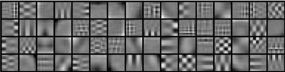

## Preprocessing of spectrograms

Sound has a high dynamic range, the energy differences in amplitude between very quiet sounds (20dB SPL)
and painful (120db SPL) is 10 orders of magnitude. To compress the values onto a smaller scale,
it is common to apply a power transform. Most common is log, but square-root or cubic-root can also be used.

Mean-normalization can be performed per filter band. Scaling can be performed by the Root-mean-square, per frame.

The following two images demonstrate the usefulness of pre-processing on Mel-spectrograms.

* `melspec-skm-rf`: Spherical k-means convolution kernels learning 

delta, lag/lead frames

https://www.researchgate.net/profile/Le_Lu/publication/275054846/figure/fig5/AS:294508295147530@1447227657495/The-first-layer-of-learned-convolutional-kernels-of-a-ConvNet-trained-on-superpixels.png

::: notes

Great summary of Sound Event Detection progress, 2010-2017.
f1 score 8.4% -> 70%. MFCC+HMM+Viterbi -> MFCC+HMM+NMF -> mel+DNN -> mel+CRNN 
http://www.cs.tut.fi/~heittolt/research-sound-event-detection0

:::

Second-order statistical summarizations by grouping frames, computing statistics per group,
and then statistics on the groups. This is sometimes called *Texture windows*.

## Introduction to sound

- Overview. Sound processing systems.
Aquisition. Storage. Processing. Output.
Online versus offline.

Digital sound pipeline

- Acoustics
- audio mixtures

### Other problem formulations

Return: Sections of audio containing desired class

Can cut the audio into pieces based on time-stamps from Event Detection. 

This can often be of interest for pre-processing of data.
For instance to avoid spending time further analyzing or labelling information
that is known to not be of interest.

In Audio Information Retrieval, a database of sounds is queried by providing or selecting an example sound.
Results should be sounds similar to the provided sound, and preferably ranked by their similarity.

Audio fingerprinting seeks to establish a unique fingerprint that is robust to transformations,
such that duplicates of an audio clip can be detected. 

Fingerprinting, retrieval and ranking is often based on a similarity metric.

In a Source Separation task, the goal is to output several track of audio,
each containing only a single source, with the other sources supressed.

## Sources of sound

Biotropy
Anthrophy

- Source characteristics

Models of sound production

- Biological models sound production in animals.
Formants
- (Acoustic models of instruments)

Rotary motor. Very beneficial to know the number of rounds per revolution

Intra-class versus inter-class variation

- Environment characteristics
Noise. Stationary, quasi-stationary
Non-class sounds.
Distance to source(s). Changing level of target sound.
Reverberation.
Microphonics,vibrations.

- Receiver characteristics.
Frequency response.
Noise.

# Data augmentation

Respects invariants/properties of features. Modelling particular challenges.

- noise addition
- volume change
- frequency response change

* Random pitch shifting
* Time-shifting
* Time reversal
* Noise additions

# Machine Learning models

- Gaussian Mixtures, Hidden Markov Model

### Criterias for good features
Keep relevant info, remove irrelevant.
Robust against variations

What is needed for good audio classification?

* Volume independent
* Robust to mixtures of other sounds
* Handles intra-class variations. Different birdsong
* Can exploit frequency patterns
* Can exploit temporal patterns

Exact traits wanted is somewhat problem/sound dependent.

* Compact. Little redundancy
* Easy to learn from
* Computationally cheap

### Open-ended classification
Classification problems often formulated as a closed-set. 
But in reality this might be too limiting.
Previously unseen birds may migrate into an area.
New musical genres are invented all the time.
Challenge: Creating a taxonomy, or consistent ontology

## Psychoacoustics
(Brief)
Non-linearities.
Log-ish frequency. notes. mel scale, gammatone
False pitch
Shepherds tone. Octave repetition
Missing fundamental
Reflection pitch

Log-ish power. desibel. 
Loudness. Stevens power law.
sones.
phones, equal loudness contours

Critical bandwidth. Loudness in mixes dependent on distances in frequency
Masking. One sound can hide another.
Simultaneous masking. Loud High tone can mask low tone.
forward masking. tensof ms

Temporal compression

Binaural hearing.

Function of sound.
Speech. "point the eyes"
Audio event. what,where

Cocktail party problem. Source separation, multi-source attention

## Case study

Add feature representations

* low-level
* MFCC
* add delta frames

