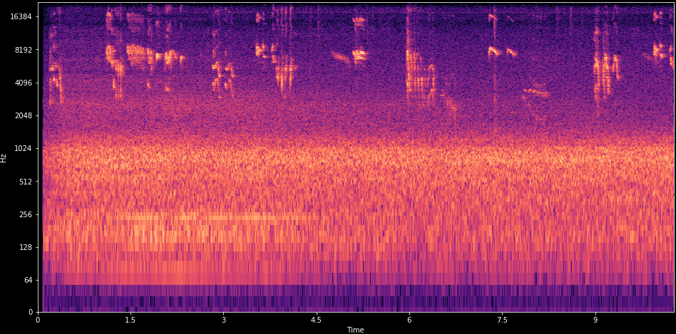
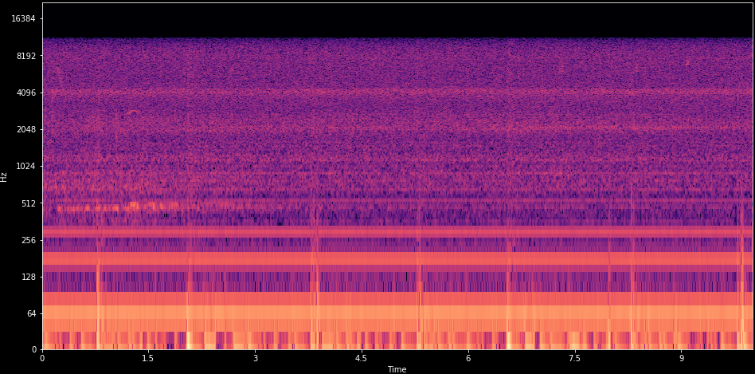

# Introduction

1 minute

## Goal

> a machine learning practitioner
> 
> without prior knowledge about sound processing
> 
> can solve basic Audio Classification problems

## Assumed knowledge

Machine learning basics

* Supervised vs unsupervised learning
* Common methods

Basic signal processing

* Sampling
* Frequency vs time-domain
* Fourier Transform
* Filter kernels, Convolutions

## Study material

*Computational Analysis of Sound Scenes and Events*.
Virtanen,Plumbley,Ellis (2018)

*Human and Machine Hearing - Extracting Meaning from Sound*, Second Edition.
Richard F. Lyon (2018)

*DCASE2018 Bird Audio Detection* challenge

50+ papers on *Acoustic Event Detection* etc.

# Machine Hearing

5 minutes

## Examples

Various usecases and tasks that Machine Hearing can be applied to.

## Speech Recognition
What is this person saying?

<audio controls src="sounds/381533__rprieto1__talking.mp3" type="audio/mp3">
  Your browser does not support the audio tag.
</audio>

::: notes

"The image I had was a subway station"

Quite easy. Most people have a very trained ear for speech.

https://freesound.org/people/rprieto1/sounds/381533/

:::

## Musical key classification
What key is this music in?

<audio controls src="sounds/261324__xinematix__piano-chord-progression-f-120-bpm.mp3" type="audio/mp3">
  Your browser does not support the audio tag.
</audio>

::: notes
Quite hard, requires musical training.

Piano Chord Progression (F - 120 BPM).wav
https://freesound.org/people/Xinematix/sounds/261324/

:::

## Audio Scene
What kind of place is this from?

<audio controls src="sounds/169043__miksmusic__school-gym-children-playing-ambiance-1.mp3" type="audio/mp3">
  Your browser does not support the audio tag.
</audio>

::: notes

Playground outdoors
https://freesound.org/people/miksmusic/sounds/169043/

Restaurant
https://freesound.org/people/soundtracvkradio/sounds/394678/

Context-aware smart devices. In the home, smartphones.

:::

## Medical diagnostics
Is this a healthy heart?

<audio controls src="sounds/heart-murmur-innocent.mp3" type="audio/mp3">
  Your browser does not support the audio tag.
</audio>

::: notes

Hard, requires very well trained doctor.
Serious, high consequences for wrong prediction.

Many examples of various innocent and unhealthy heart sounds, explained.
https://www.easyauscultation.com/heart-sounds-audio

Heart Sounds and Heart Murmurs, Animation.
https://www.youtube.com/watch?v=dBwr2GZCmQM
Very clear explanation of normal and various abnormal heart sounds.

Heart classification challenge.
http://www.peterjbentley.com/heartchallenge/

:::

## Industrial monitoring
Is this machine operating normally?

<audio controls src="sounds/211087__vumseplutten1709__wornoutballbearing.mp3" type="audio/mp3">
  Your browser does not support the audio tag.
</audio>

::: notes

wornoutballbearing.wav
https://freesound.org/people/vumseplutten1709/sounds/211087/

:::

## Ecoacoustics
What kind of animal is this?

<audio controls src="sounds/67261__benboncan__frog-croaking.mp3" type="audio/mp3">
  Your browser does not support the audio tag.
</audio>

::: notes

https://freesound.org/people/Benboncan/sounds/67261/
Ecoacoustics. Measuring biodiversity.

:::

## Established subfields

- Speech Recognition
- Music Information Retrieval
- **Sound Scenes and Events**


# Brief primer on sound

3 minutes

## Acoustic model
Sources. Channel. Receiver.

## Audio Mixtures
A sound seldom appears alone.

::: notes

Sometimes separable in time-frequency.
Many sounds have patterns in frequency. Eg voice formants

:::

## Channel effects
Noise
Frequency response
Reverberation

## Human hearing

Approx 20Hz - 20kHz.
Binaural

A non-linear system

* Loudness is not linear with sound pressure
* Loudness is frequency dependent 
* Compression. Sensitivity lowered when loud
* Masking. Close sounds can hide eachother

::: notes
TODO: picture of ear/hearing
:::

## Digital sound

sound -> Microphone -> Analog to Digital Converter

* Quantized in time (ex: 44100 Hz)
* Quantizied in amplitude (ex: 16 bit)
* Uncompressed formats: PCM .WAV
* Lossless compression: .FLAC
* Lossy compression: .MP3

FIXME: picture of digitization process

# A practical example: Bird Detection


## DCASE2018 challenge

* 10 second audio clips
* Has bird? yes/no => **binary classification**
* One label for entire clip => weakly annotated
* 3 training sets, 3 test sets. 45'000 samples

**Mismatched conditions**: 2 testsets with no training samples. 

::: notes

How much or where in clip bird occurs = unknown.

:::

## Bird sounds



<audio controls src="sounds/4dd5046d-c962-4f02-a820.wav" type="audio/wav">
  Your browser does not support the audio tag.
</audio>

## More realistic



<audio controls src="sounds/00adbc49-77ef-4b7e-a453-cbb4ee011e11.wav" type="audio/wav">
  Your browser does not support the audio tag.
</audio>

# Feature extraction

10 minutes

## Audio classification pipeline

FIXME: find/make a picture of the process

::: notes

10 second clip
Audio                Features            bird yes/no
-> [Feature Extraction] -> [Classifier] -> 

:::


## Frames


Cut audio into short overlapping segments

## Low-level features


Basic statistics on spectrogram 

::: notes
TODO: add images explaining the summarization
:::


## Summarizations

* min,max
* mean,std
* Kurtosis,skew

FIXME: add image of resulting vector

::: notes

Bag-of-Words. Temporal ordering is ignored.
Inspired by successes in text analysis / Natural Language Processing.

:::

## Delta frames

Delta frames: Difference between successive frames

Delta-delta frames: Difference between delta frames

Summarized independently.

::: notes

FIXME: add image explaining this

:::

## Texture windows


## mel-scale filters


Reduces number of bands in spectrogram.
Perceptually motivated.

::: notes

40-64 filters typical.

Analysis of Accent-Sensitive Words in Multi-Resolution Mel-Frequency Cepstral Coefficients for Classification of Accents in Malaysian English
https://www.researchgate.net/figure/Mel-filter-banks-basis-functions-using-20-Mel-filters-in-the-filter-bank_fig1_288632263

:::

## mel-spectrogram


Spectrogram filtered by mel-scale triangular filters

::: notes

mel-scale filters
Reduces number of banks
:::

## What about noise?

There are birds in here!


## Filtered mel-spectrogram


Subtracted filterbank means, added Median filter (3x3)

## Mel-filter Cepstrum Coefficients (MFCC)


Discrete Cosine Transform (DCT-2) of mel-spectrogram

::: notes

More compact representation. Easy to compress, cut of higher coefficients.
De-correlated, important for non-linear methods.
With strong classifiers, not as good as mel-spectrograms.

:::

## Feature learning
Learning a dictionary of small convolutional kernels (ex 3x3)

Unsupervised, from random patches

* Clustering. Spherical k-means
* Matrix Factorization. Sparse Non-negative MF

Transfer: Copy from existing models

Supervised: Back-propagation (Convolutional NN)

::: notes

Local pattern matching.
FIXME: add picture of a set of kernels
TODO: picture of 2d convolution, input+output

Feature Learning with Matrix Factorization Applied to Acoustic Scene Classification.
:::


## Advanced feature representations

Examples

* Wavelet filterbanks
* Scattering Transform
* CARFAC. Perceptual cochlear model

Not so much used

# Classifiers

## Classic models

The usual suspects

* Logistic Regression
* Support Vector Machine 
* Random Forests

Also popular in Audio Classification

* Gaussian Mixture Models (GMM)
* Hidden Markov Model (HMM)

::: notes

:::

## Deep learning

* Convolutional Neural Network (CNN) + dense layers 
* Fully Convolutional Neural Network (FCNN)
* Recurrent Convolutional Neural Networks (RCNN)

::: notes
TODO: add a nice image of deep learning. Neural network
:::

# Comparison of different approaches

## Workbook

https://github.com/jonnor/birddetect

Important files:

* Model.ipynb
* dcase2018bad.py
* features.py

## Classifier


## Feature extraction

```python
def melspec_maxp(data, sr):
    params = dict(n_mels=64, fmin=500, n_fft=2048, fmax=15000, htk=True)
    mel = librosa.feature.melspectrogram(y=data, sr=sr, **params)

    mel = meansubtract(mel)
    mel = minmaxscale(mel)
    # mel = medianfilter(mel, (3,3))

    features = numpy.concatenate([
        numpy.max(mel, axis=1),
    ])
    return features
```

## Dask parallel processing 

```python
    chunk_shape = (chunk_size, feature_length)
    def extract_chunk(urls):
        r = numpy.zeros(shape=chunk_shape)
        for i, url in enumerate(urls):
            r[i,:] = feature_extractor(url)
        return r

    extract = dask.delayed(extract_chunk)
    def setup_extraction(urls):
        values = extract(urls)
        arr = dask.array.from_delayed(values,
                            dtype=numpy.float,
                            shape=chunk_shape)
        return arr

    arrays = [ setup_extraction(c) for c in chunk_sequence(wavfiles, chunk_size) ]
    features = dask.array.concatenate(arrays, axis=0)
    return features
```

## Feature processing time

41'000 audio files... 0.2 seconds each

Laptop: **2 hours**

5 dual-core workers: **10 minutes**

Cost for 10 hours compute: `<50 NOK`

https://docs.dask.org/en/latest/setup/kubernetes.html

## Results


| Name  | Features | Classifier |  AUC ROC  |
| ------- |:-------------:|:-----:|-----:|
| Lasseck | melspectrogram | CNN  |  89%  |
| ..... | melspectrogram  | CNN | 78%-84% |
| skfl | melspec-conv-skmeans | RandomForest | 73.4 % |
| **jonnor** | melspec-max | RandomForest | 70%[1] |
| smacpy | MFCC-meanstd | GMM | 51.7 % |

http://dcase.community/challenge2018/task-bird-audio-detection-results

    1. Public leaderboard score, not submitted for challenge

## Best performing models also used

Data Augmentation

* Random pitch shifting
* Time-shifting
* Time reversal
* Noise additions

Tricks 

* Ensemble. Model averaging
* Self-adaptation. Pseudo-labelling

::: notes

bulbul/sparrow.
Two Convolutional Neural Networks for Bird Detection in Audio Signals. Thomas Grill, Jan Schlüter.

Bird Audio Detection Challenge 2016–2017
http://c4dm.eecs.qmul.ac.uk/events/badchallenge_results

:::

# Summary

1 minutes
If you have an Audio Classification problem...


## Feature representation

Try first **mel-spectrogram** (log or linear).

MFCC only as fallback

## Machine Learning method

Try Convolutional Neural Networks (or RCNN) first.

Alternative: Learned convolutional kernels + RandomForest

Probably avoid: MFCC + GMM/HMM

## Tricks

Subtract mel-spectrogram mean. Consider median filtering.

Use data augmentation.

Try Transfer Learning. Can be from image model!

# Questions?


# Bonus

Anything that did not fit...


# Problem formulations

5minutes

## Classification

Return: class of this audio sample

* Bird? yes/no (binary)
* Which species is this? (multi-class)

::: notes
FIXME: add (background?) image of spectrogram 
:::

## Event detection
Return: time something occurred.

* "Bird singing started", "Bird singing stopped"
* Classification-as-detection. Classifier on short time-frames
* Monophonic: Returns most prominent event

::: notes

Great summary of Sound Event Detection progress, 2010-2017.
f1 score 8.4% -> 70%. MFCC+HMM+Viterbi -> MFCC+HMM+NMF -> mel+DNN -> mel+CRNN 
http://www.cs.tut.fi/~heittolt/research-sound-event-detection0

:::

## Polyphonic events
Return: times of all events happening

Examples

* Bird singing, Human talking, Music playing
* Bird A, Bird B singing.

Approaches

* separate classifiers per 'track'
* joint model: multi-label classifier

::: notes

:::

## Audio segmentation

Return: sections of audio containing desired class

* Ex: based on Event Detection time-stamps
* Pre-processing to specialized classifiers

## Source separation

Return: audio with only the desired source

* Masking in time-frequency domain
* Binary masks or continious 
* Blind-source or Model-based


## Other problem formulations

* Tagging
* Audio fingerprinting.
* Searching: Audio Information Retrieval


## Remaining work

* Implement kernel learning (spherical k-means)
* Implement a Convolutional Neural Network
* Compare the different models, summarize
* Finish writing report

## DCASE2018 workshop

Reports from challenge tasks:

1) Acoustic scene classification
1) General-purpose audio taggging
1) **Bird Audio Detection** 
1) semi-supervised: Domestic sound event detection
1) multi-channel acoustics: Monitoring of domestic activities

I am going! November 19-21, London.

## Continious Monitoring

Audio Classification often collected periodically,
then training and classification done after-the-fact.

Writing a report in TIP360:

*Designing a Wireless Acoustic Sensor Network for machine learning*

## Parallell processing features with Dask

TODO: add code samples

https://github.com/jonnor/birddetect/blob/master/Model.ipynb


## Desirable traits
What is needed for good audio classification?

* Volume independent
* Robust to mixtures of other sounds
* Handles intra-class variations. Different birdsong
* Can exploit frequency patterns
* Can exploit temporal patterns

::: notes

Exact traits wanted is somewhat problem/sound dependent.

* Compact. Little redundancy
* Easy to learn from
* Computationally cheap

:::

## Time domain

Hard to discriminate sounds in realistic settings:

* Samples are highly correlated
* Frequency information mixed with temporal
* Sensitive to noise

Actively researched using very strong models and large datasets.

::: notes
IMAGE. Waveform

:::

## Time-domain
Linear, logarithmic. Amplitude versus power.

FIXME: picture of linear + logarithmic

## Frequency-domain
Fourier Transform.

FIXME: picture of frequency response

## Spectrograms
Time-frequency domain.

Tradeoff. Time vs frequency resolution.

FIXME: picture of spectrogram

