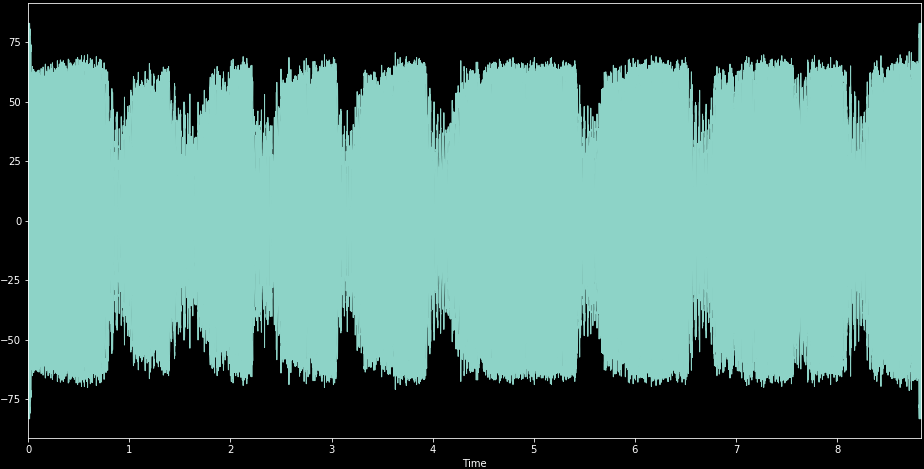
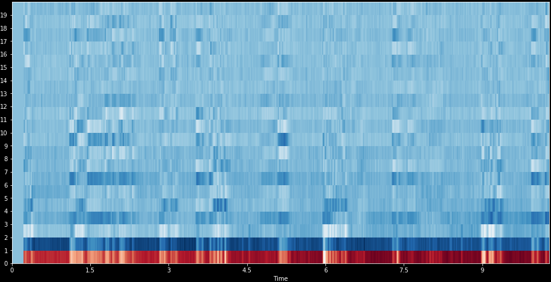
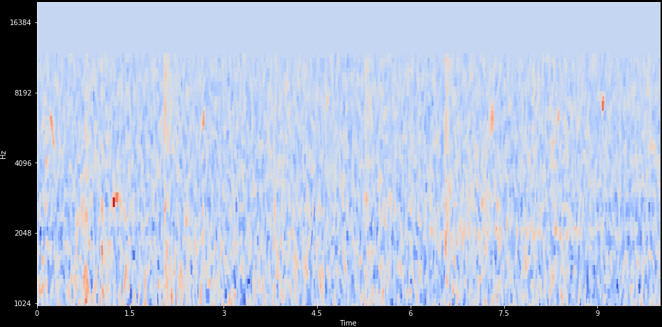

## Meta

### Test
This is a reference test [@pizza2000identification].

`FIXME: references dont work`

focus on audio event detection and a review methods applied on birdsong detection.

This is a referene to \ref{mylabel}.

# Introduction

### Scope

Sound, and machine learning on sound, is a wide topic.
Some areas have enough interest to be considered their own fields.
This especially includes machine understanding of human speech (*Speech Recognition*) and
the computational analysis of music (*Music Information Retrieval*).

`TODO: recommend literature on Speech Recognition`
`TODO: recommend l. on Music Information Retrieval`

This paper instead focuses on detection and classification of *Acoustic Events*.
Such events can be any kind of sound, and in contrast to speech and music,
are often not produced with an intent to communicate.
Many of the techniques utilized for Acoustic Events can also be
used within speech and music, and many methods were in fact adopted from these fields.

While a basic understanding of the human auditory system can be beneficial when developing machine hearing,
coverage of Psychoacoustics will kept brief. Those interested in a detailed treatise on this subject can read [@].

`TODO: recommend book. Human and Audio` 
`TODO: recommend bird vocalization literature`

The paper assumes some prerequisite knowledge on machine learning.
In particular it is assumed that the reader:
knows the difference between supervised and unsupervised learning;
knows task formulations like Classification, Clustering and Regression;
basic familiarity with common methods like Support Vector Machine, Random Forests and Convolutional Neural Networks.

`TODO: recommend ML introduction`

Basic familiarity with Digital Signal Processing is assumed.
In particular knowledge of the Fourier Transform, digital filters and convolutions.

When it comes to acoustics and audio processing, neccesary background information is provided in the first section.
We will then cover Machine Learning methods for Acoustic Event Detection generally. 
And at the end, we will look at the task of detecting the presence of birds.

This is an example from the fields of Bioacoustics and Ecoacoustics,
using acoustics as a tool to study biology and ecology.
However we will not go into the physical models of how bird vocalize,
nor the biological or ecological meaning of these.

The case study uses the Python programming language, and the machine learning frameworks
scikit-learn and Keras. Prior familiarity with these tools will make it easier to
start applying these to tasks of your own.

In summary, our goal is that after reading this report:
a machine learning practitioner,
without prior knowledge about sound and audio processing,
is be able to solve basic Acoustic Event Detection problems.

# Background 

## Introduction to sound

- Overview. Sound processing systems.
Aquisition. Storage. Processing. Output.
Online versus offline.

Digital sound pipeline

.

    `FIXME: make/find better picture`

- Acoustics

- audio mixtures

### Sources of sound

Biotropy
Anthrophy

- Source characteristics

Models of sound production

- Biological models sound production in animals.
Formants
- (Acoustic models of instruments)

Rotary motor. Very beneficial to know the number of rounds per revolution

Intra-class versus inter-class variation

- Environment characteristics
Noise. Stationary, quasi-stationary
Non-class sounds.
Distance to source(s). Changing level of target sound.
Reverberation.
Microphonics,vibrations.

- Receiver characteristics.
Frequency response.
Noise.

### Digital sound representation

* Quantized in time (ex: 44100 Hz)
* Quantizied in amplitude (ex: 16 bit)
* N channels. **Mono**/Stereo
* Uncompressed formats: PCM .WAV
* Lossless compression: .FLAC
* Lossy compression: .MP3

Time-domain

Frequency-domain

Fourier Transform.

Time-frequency domain

Using Short-Time-Fourier-Transform (STFT)

Tradeoff time/frequency resolution.
Multi-resolution STFT

### Psychoacoustics
(Brief)
Non-linearities.
Log-ish frequency. notes. mel scale, gammatone
False pitch
Shepherds tone. Octave repetition
Missing fundamental
Reflection pitch

Log-ish power. desibel. 
Loudness. Stevens power law.
sones.
phones, equal loudness contours

Critical bandwidth. Loudness in mixes dependent on distances in frequency
Masking. One sound can hide another.
Simultaneous masking. Loud High tone can mask low tone.
forward masking. tensof ms

Temporal compression

Binaural hearing.

Function of sound.
Speech. "point the eyes"
Audio event. what,where

Cocktail party problem. Source separation, multi-source attention

# Applications
of machine learning on sound

`TODO: move to introduction`

* Ecoacoustics/bioacoustics. Population estimation. Health monitoring.
* Structural monitoring.
* Predictive maintenance. Anomaly detection.
* Process control. Do something once audible event happens. Coffe
* Smart home / home automation.  Children crying, smokealarm
* Security. Intrusion detection. Aggression detection.
* Surveillance. Event detection for. Voice

Structure-borne sound. Vibrations.

Sound in water. Hydrophonics

# Problems formulations

- Classification
- Detection, precise time
- Segmentation
- Source/individual identification
- Diarization 
- Monophonic vs polyphonic
- Multi-class
- Open ended
- Anomaly/novelity detection

## Classification

Return: class of this audio sample

* Bird? yes/no (binary)
* Which species is this? (multi-class)

::: notes
FIXME: add (background?) image of spectrogram 
:::

## Event detection
Return: time something occurred.

* "Bird singing started", "Bird singing stopped"
* Classification-as-detection. Classifier on short time-frames
* Monophonic: Returns most prominent event

::: notes

Great summary of Sound Event Detection progress, 2010-2017.
f1 score 8.4% -> 70%. MFCC+HMM+Viterbi -> MFCC+HMM+NMF -> mel+DNN -> mel+CRNN 
http://www.cs.tut.fi/~heittolt/research-sound-event-detection0

:::

## Polyphonic events
Return: times of all events happening

Examples

* Bird singing, Human talking, Music playing
* Bird A, Bird B singing.

Approaches

* separate classifiers per 'track'
* joint model: multi-label classifier

::: notes

:::

## Audio segmentation

Return: sections of audio containing desired class

* Ex: based on Event Detection time-stamps
* Pre-processing to specialized classifiers

## Source separation

Return: audio with only the desired source

* Masking in time-frequency domain
* Binary masks or continious 
* Blind-source or Model-based

## Other problem formulations

* Tagging
* Audio fingerprinting.
* Searching: Audio Information Retrieval

Example: Musical genre classification

Audio search
 Find similar to this.

### Open-ended classification
Classification problems often formulated as a closed-set. 
But in reality this might be too limiting.
Previously unseen birds may migrate into an area.
New musical genres are invented all the time.
Challenge: Creating a taxonomy, or consistent ontology

# Feature extraction

Criterias for good features
Keep relevant info, remove irrelevant.
Robust against variations

What is needed for good audio classification?

* Volume independent
* Robust to mixtures of other sounds
* Handles intra-class variations. Different birdsong
* Can exploit frequency patterns
* Can exploit temporal patterns

Exact traits wanted is somewhat problem/sound dependent.

* Compact. Little redundancy
* Easy to learn from
* Computationally cheap

Cut audio into short overlapping segments

Normalization

### Low-level features
spectral center, spectral slope etc

Basic statistics on spectrogram 

Standard low-level (SLL) signal parameters, includes: (1) root-mean-
square (RMS) level, (2) spectral centroid, (3) bandwidth, (4) zero-crossing rate, (5) spectral roll-off
frequency, (6) band energy ratio, (7) delta spectrum magnitude, (8) pitch, and (9) pitch strength

FEATURES FOR AUDIO CLASSIFICATION. Jeroen Breebaart. 2.1.1 Low-level signal parameters. 

Spectral flatness.
Spectral envelope. N-channel smooth approximation of spectrogram.

"Normalizing features across time avoids bias towards high-range features"

http://www.nyu.edu/classes/bello/MIR_files/timbre.pdf

Autocorrelation. Self-similarity

### Time-frequency representations
STFT, windowing
filter-banks. Constant-Q. Fourier transform. Bark scale

### mel-spectrogram

Reduces number of bands in spectrogram.
Perceptually motivated.
40-64 filters typical.

Spectrogram filtered by mel-scale triangular filters.

### MFCC

Discrete Cosine Transform (DCT-2) of mel-spectrogram

More compact representation. Easy to compress, cut of higher coefficients.
De-correlated, important for non-linear methods.
With strong classifiers, not as good as mel-spectrograms.

delta, lag/lead frames
Summarizations
first-order, second-order statistics

min,max,skew,Kurtosis,...

::: notes

Bag-of-Frames. Temporal ordering is ignored.
Inspired by Bag-of-Words success in text analysis / Natural Language Processing.

Texture windows

## Convolution

Local feature detector

https://i1.wp.com/timdettmers.com/wp-content/uploads/2015/03/convolution.png?resize=500%2C193

Generalizes the delta frames

https://www.researchgate.net/profile/Le_Lu/publication/275054846/figure/fig5/AS:294508295147530@1447227657495/The-first-layer-of-learned-convolutional-kernels-of-a-ConvNet-trained-on-superpixels.png

### Biologically based
Coclear models
CARFAC

### Wavelet based
* Wavelet filterbanks
* Scattering transform

### Representation learning
Convolutional kernels

Unsupervised, from random spectrogram patches

* Clustering. Spherical k-means
* Matrix Factorization. Sparse Non-negative MF

Transfer: Copy from existing models

"Feature Learning with Matrix Factorization Applied to Acoustic Scene Classification"

### End2End learning

Using the raw audio input as features with Deep Neural Networks.

Need to learn also the time-frequency decomposition,
normally performed by the spectrogram. 

Actively researched using advanced models and large datasets.

# Pre-processing
- Noise reduction
- Source separation

Processing on spectrograms

Subtracted filterbank means, added Median filter (3x3)

# Data augmentation

Respects invariants/properties of features. Modelling particular challenges.

- noise addition
- volume change
- frequency response change

* Random pitch shifting
* Time-shifting
* Time reversal
* Noise additions

# Machine Learning models

- Linear
- Tree-based
- CNN
- Gaussian Mixtures, Hidden Markov Model

# Case study
On DCASE2018 bird-detection challenge.

## Bird vocalization detection

Problem definition

* 10 second audio clips
* Has bird? yes/no => **binary classification**
* One label for entire clip => weakly annotated
* 3 training sets, 3 test sets. 45'000 samples

**Mismatched conditions**: 2 testsets with no training samples. 

How much or where in clip bird occurs = unknown.

## Evaluation

Evaluation

* accuracy
* training time
* prediction time (incl feature extration)

## Compared methods

Features

* low-level
* MFCC
* melspectrogram (log?)
* add delta frames
* Scale Invariant Feature Transform (SIFT)
* Histogram of Oriented Gradients (HOG) 
* learned convolution kernels
* combinations

Classifiers

* Linear. SVC? LogisticRegression?
* RandomForest
* CNN

## Results

# References

