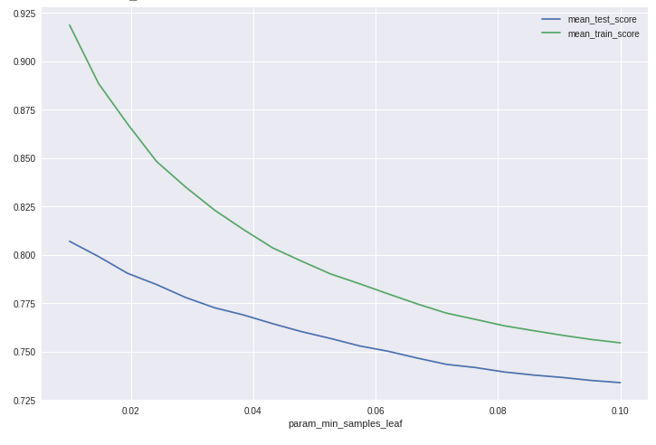
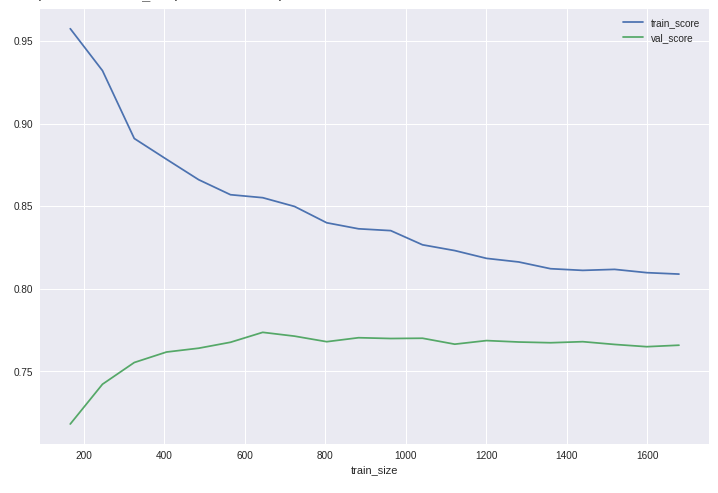

---
header-include:
- \usepackage{float}
---

\newpage
# Introduction

Sound, and machine learning on sound, is a wide topic.
Some areas have enough interest to be considered their own fields.
This especially includes machine understanding of human speech (*Speech Recognition*) and
the computational analysis of music (*Music Information Retrieval*).

This paper instead focuses on detection and classification of *Acoustic Events*.
Such events can be any kind of sound, and in contrast to speech and music,
are often not produced with an intent to communicate.
Many of the techniques utilized for Acoustic Events can also be
used within speech and music, and many methods were in fact adopted from these fields.

While not as popular as computer vision or natural language processing,
the application of machine learning to acoustic events can be
found across many fields of scientific study and in many industries.

[@HeartAscultationPortable] designed a portable unit for assisted with heart ascultation,
a common acoustic procedure to screen for heart problems.
In [@AcousticEmissionLandslide] acoustic emission was used to create sensors
for early warning of landslides.
[@AcousticEventDetectionSurveillance] explains how detection of acoustic events
can assist security camera operators in spotting situations of interest.
In [@AcousticMonitoringBirdMigration] bird migration
patterns are studied using acoustic monitoring.
In domestic animal care, [@AcousticMonitoringCattleGrazing] shows
an acoustic method for monitoring cattle feeding activity.
Acoustic events are used in industry for non-destructive quality control,
predictive maintenance of machinery and in structural analysis of buildings.

In most application scenarios, analysis is done on audible sound transmitted via the air.
However there are fluid-borne sound (hydrophony) and structure-borne sounds and vibrations,
and sounds are below the audible frequency range for humans (infrasound) and some above (ultrasound).
The techniques presented here should apply in general across these modalities.

While a basic understanding of the human auditory system can be beneficial when developing machine hearing,
Psychoacoustics will not be covered here. Those interested in a detailed treatise on this subject can read [@HumanMachineHearing].

The paper assumes some prerequisite knowledge on machine learning, in particular
difference between supervised and unsupervised learning;
common task formulations like Classification, Clustering and Regression;
and common methods like Random Forests and Convolutional Neural Networks.
A good primer is [@PythonMachineLearning].

Basic familiarity with Digital Signal Processing is assumed.
In particular knowledge of the Fourier Transform, digital filters and convolutions.

When it comes to sound, a brief background is provided.
We will then cover the main theoretical aspects of Machine Learning for Acoustic Event Detection and Classification,
and then use the task of detecting the presence of birds as a practical example.

In summary, the goal is that after reading this report:
a machine learning practitioner,
without prior knowledge about sound and digital audio processing,
is be able to solve basic Acoustic Event Detection problems.

\newpage
# Theory

## Background 

### Digital sound

Physically, sound is a variation in pressure over time.
For machine learning, it must be exist in a digital representation.
The acoustic data is converted to analog electric signals by a microphone and
then digitized using an Analog-to-Digital-Converter (ADC).

![From acoustical sound to digital and back. Source: [@ProcessingTutorial]](./images/digital-sound-processingorg.png)

In the digitization process, the signal is quantized in time at a certain sampling frequency,
and the amplitude quantized at a certain bitdepth.
A typical sampling frequency is 44100 Hz, and bitdepth 16 bit. With these parameters,
the acoustic sound can be reconstructed without perceivable differences by humans.

Digital sound can be stored uncompressed (PCM .wav), using lossless compression (.flac)
or using lossy compression (.mp3). Lossy compression removes information and may add artifacts,
and is best avoided for machine learning tasks.
Recordings can be multi-channel but for acoustic events
single-channel (mono) data is still the most common.

\newpage
### Time domain

In the time domain an audio signal is seen as a continiously varying
signal corresponding to the pressure variation of the acoustic signal.

### Frequency domain
Using the Fourier Transform, the audio can be losslessly converted to the frequency domain.

### Time-Frequency domain
Using Short-Time-Fourier-Transform (STFT), the audio can be mapped to the Time-Frequency domain.

The STFT has a tradeoff in time/frequency resolution.
Multi-resolution STFT can be used if high resolution in both time and frequency is needed.

\newpage
## Problem formulations

### Classification

In classification the goal is to determine the which acoustic event appears in an audio sample.
Samples can be short relative to the acoustic event length, or long, possibly having many instances of an event.
The number of events and their time is not returned in classification.

![Classification task with one class label per audio sample. Source: [@ComputationalAnalysisSound, fig 6.1]](./images/classification.png)

The classification can be binary (is this birdsong?), or multi-class (which species is this?).
Classification is often limited to a single label.

When the classification is done on long samples consisting of many different events
it is called Acoustic Scene Classification. Examples of a 'scene' in urban environments
could be 'restaurant', 'park', 'office', each having a different
composition of typical acoustic events.

### Event Detection

In event detection (also known as onset detection) the goal is to find the time spans where a given acoustic event occurs.
If the acoustic event is "frog croaking", then for each instance of a frog croak
the start time and end time of this event should be marked.

![Event detection, with labels at precise start and end locations in time. Source: [@ComputationalAnalysisSound, fig 6.3] ](./images/eventdetection.png)

In monophonic event detection, only the most prominent event is returned.
A classifier ran on short samples relative to the length of the acoustic event
can be used a detector.

In polyphonic event detection, multiple events are allowed at the same time.
This can be approached using separate classifiers per event type,
or using a multi-label classifier as a joint model.

### Weak labeling

Many acoustic events are short in duration, for instance a door slamming.
Other acoustic events only happen intermittently, like the the frog vocalizations in previous example.

Under supervised learning, ideally each and every of the acoustic events instances in the training data
would be labeled with their start and end time. This is called 'strong labels'.
However aquiring strong labels requires careful attention to detail by the annotator and is costly.

Therefore, often per-event time-based labels are not available.
Instead fixed-length audio clips are only marked whether an event occurs at least once, or not at all.
This is called a 'weak label' or 'weakly annotated' data.

When performing event detection, with small time windows (compared to annotated audio clips) as input,
the missing time information means there is not a direct label for this input.
This is known as a Multiple Instance Learning (MIL) problem.
Under MIL input instances are grouped into a 'bag', and the label exists on the bag
instead of the individual instances.
MIL formulations exist for many common machine learning algorithms.

\newpage
# Feature representations

In a typical machine learning pipeline, raw data is transformed into features
for the machine learning model via feature extraction.
The typical feature extraction process and feature representation is discussed here.

## Frames

To process and analyze the audio data it is often represented as *frames*, small groups of samples across time.
Frames can be produced in real-time, by collecting N samples at a time,
or by splitting up audio files after they have been recorded.

In a frame based approach, a frame is the smallest unit of time processed by the machine learning algorithm.
Therefore the frame length must be set long enough to contain enough relevant information,
but not so long that temporal variations disappear. For speech, a typical choice of frame length is 25ms.
Similar frame lengths are often adopted for acoustic events, unless there are specific concerns.

![Computing frames from an audio signal, using windows functions. Based on image by [@AudioFraming]](./images/frames.png)

Frames often use overlapping samples at the start and end.
Without overlap, acoustic event that happens partially in one frame results in different signals than when appearing in the middle.
The overlap can be specified as percentage of the frame length (overlap percentage).
or as a number of samples (hop length). Overlap can for instance be 50%.
A window function is applied to ensure that the signal level stays constant also in overlapping sections.

## Low-level features

From the samples in each frame, features can be calculated.

[@Breebaart2004, Ch 2.1.1] defined a Low-Level feature set for audio classification as:

1. root-mean-square (RMS) level
2. spectral centroid
3. spectral bandwidth
4. zero-crossing rate
5. spectral roll-off frequency,
6. band energy ratio,
7. delta spectrum magnitude,
8. pitch and (9) pitch strength

Of these, root-mean-square (RMS) and zero-crossing rate (ZCR)
are calculated directly on the samples in the time-domain.

The spectral features are computed using the Fourier Transform on a frame,
and then summarizing with standard statistics. See [@DonggeLi2001] for the definitions.

Low-level spectral features, being univariate statistics on the spectrogram,
removes a lot of the information present.

## Spectrograms

A raw Short Time Fourier Transform can contain 1024 or more bins, often with strong correlation across multiple bins.
To reduce dimensionality, the STFT spectrogram is often processed with a filter-bank of 40-128 frequency bands.
Some filter-bank alternatives are 1/3 octave bands, the Bark scale, Constant-Q transform and the Mel scale.
All these have filters spacing that increase with frequency, mimicking the human auditory system.

## Mel-spectrogram

A spectrogram processed with triangular filters evenly spaced on the Mel scale is called a Mel-spectrogram.

![Mel-spaced filterbank. Filters are set to to be unity-height. Mel-filters using unit-area filters also exist. Source: [@SpeechProcessingTutorial]](./images/mel-filterbanks-20.png)

A mel-spectrogram can still have significant correlation between bands.

## MFCC

To reduce correlation one can compute the Discrete Cosine Transform (DCT-2) on the mel-spectrogram.
The result is known as the Mel Filter Cepstrum Coefficients (MFCC).

Another advantage of the DCT is that important information in the signal tends to end up in the lower coefficients.
Therefore it can be compressed efficiently (but lossily) by dropping the higher coefficients. 13-20 coefficients is common.

The band in the cepstrum are the coefficient of cosines that when summed together reconstruct the input (using the inverse DCT).
This means that events that are close in frequency domain are no longer next to each other in a MFCC matrix,
making local pattern-matching algorithms less effective. 
Therefore they are not so popular for use with Convolutional Neural Networks,
but mostly used with linear models such as Gaussian Mixture Models (GMM) and Hidden Markov Models (HMM.

## Summarizing features

When classifying longer segments of labeled audio it can be desirable to come up with a summary that represents the entire clip.
This can be done by computing statistics across the per-frame features for all frames in the clip.

![Clip summarizations of frames. Source: [@LowlevelFeaturesTimbre, p.27]](./images/summarizing-frames.png)

Any statistical aggregate functions can be used, such as `min`, `max`, `median`, `mean`, `skew`, `Kurtosis`, etc.
In a summary the order of frames is ignored, and we have a Bag-of-Frames feature model.

## Convolution

A convolution filter (also called kernel) allows to express many common transformations
on 1d or 2d data, like edge detection (horizontal/vertical) or smoothening filters (median). 
But kernels kernel can be seen as parametric local feature detector can express more complex problem-specific
patterns, like a upward or downward diagonal from a bird chirp when applied to a spectrogram.
Using a set of kernels in combination can detect many pattern variations.

![Convolution kernel as edge detector, applied to image. Source: [@UnderstandingConvolution]](./images/convolution.png)

## Feature learning

To avoid having to manually design or choose convolution kernels, they can be learned from data.
One approach is to randomly select small N,M sized patches from the spectogram and to reduce this
into a a representative codebook using vector quantization.
In [@BirdFeatureLearning], this was done for detection of birdsong using *spherical k-means* clustering,
a variation of k-means using the cosine (dis)similarity as the distance metric.
In  [@FeatureLearningMatrixFactorization], Sparse Non-negative Matrix Factorization was used for
Acoustic Scene Classification.

Other unsupervised methods include and Convolutional AutoEncoders (CAE).
In [@FeatureLearningAutoEncoder], CAEs were stacked to obtain a 'deep' model of hierarchical features.

If large amount of labeled data are available, a Convolutional Neural Network (CNN)
can be used for supervised learning of deep network of convolution operators.
CNN-based models using log mel-spectrogram features are the best performing models in many
audio classification problems, such as those in [@DCASE2018Results].

## Learning on raw audio waveform

Deep neural networks can also the raw audio waveform as input features,
skipping the spectrogram computation step.
This learning a model without dedicated feature extraction, is sometimes called 'end 2 end' learning.

[@RawWaveformCNN] was able to train a Convolutional Neural Network on raw waveform data
to match log-mel spectrogram features in an audio classification task.
The network also needed to jointly learn bandpass filters in the first layers to
replace the transformation normally performed by the spectrogram.

Such models can also be used in fusion with spectrogram model, as in [@RawWaveformMelSpectrogramFusion]. 

## Other feature representations
A large amount of alternative feature representations have been proposed.
Some have explored wavelet filterbanks and the Scattering transform [@ScatteringUrbanSound].

Prior to efficient convolutional neural networks, image-based features like
Scale Invariant Feature Transform (SIFT) and Histogram of Oriented Gradients (HOG) 
have also been applied to spectrograms [@SIFTMusicStyle], [@HOGSpeechRecognition].

Feature extraction models that more closely mimics the human hearing system
include Cascade of Asymmetric Resonators with Fast-Acting Compression (CARFAC) [@CARFACMachineHearing].

\newpage
# Case study

To apply the above theory, we look at the Bird Audio Detection task from the
DCASE2018 machine-learning challenge.

Some code will be provided inline for illustration, while the
full code is available at https://github.com/jonnor/birddetect as executable Jupyter Notebooks.

## Bird vocalization detection

The problem formulation is binary classification:
the system should output whether audio sample has bird(s) or not.

* 10 second audio clips
* One label for the clip (weakly annotated)
* 3 training sets, 3 test sets
* Total 48'000 samples

The 2018 edition of this challenge is focused on generalizable performance.
Therefore 2 of the test sets are recorded at different locations with different equipment
than the training samples (mismatched conditions).

## Feature representation

As a basis for feature representations, the mel-spectrogram is used.
The mel-spectrogram is calculated with 64 mel-filter bands, from 500Hz to 15000 Hz.
Exploration of the dataset showed that many recordings had a lot of static white-noise below approximately 1000Hz,
and not all recordings had data above approximately 16KHz.
The implicit assumption is that most or all of the bird vocalization is inside the preserved range.

## Method

A baseline method of RandomForest on max-summarized mel-spectrogram was implemented first.

An attempt was also made to use transfer learning of a CNN model trained on ImageNet,
however this failed to give good results. Even a trivial LogisticRegression on top
of the max or mean pooled output failed to progress higher than 60% accuracy.
Problem occurred with or without data augmentation.
Fine tuning the network also did not improve the results.
A bug was discovered in the pre-processing of the spectrograms used by this model,
which may have been the root cause.

The RandomForest model with 100 trees was tested on a dataset of 3000 files,
1000 for each of the 3 labeled datasets, sampled randomly.
AUC ROC was used as the score metric. 33% of the data was left out as a testing set.

The code is available as a Jupyter notebook at https://github.com/jonnor/birddetect/blob/0.1.0/Baseline.ipynb

## Results

A grid-search with 5 cross-validation was performed on the training set to determine appropriate hyperparameters.
The `min_samples_leaf` parameter was used to limit the depth of the RandomForest trees.
A range of `1%` to `20%` of trainingset size was tested.

Accepting some variance, a `min_samples_leaf` of `0.04` was chosen.

A learning curve was computed to evaluate whether the model was limited by the dataset size.

When computing the AUC ROC score on the left-out testing set, it scored `76.9%`.

## Discussion

By default sklearn RandomForest has no depth limit.
With the lowest tested limit, `min_sample_leaf=0.01`,
the model performs 93% on training and 81% on test, suggesting serious overfitting.
So hyperparameter tuning was critical to avoid overfitting.

The score of `76.9%` on the testing set matches the `76-77%` in validation in (from gridsearch and learning curve).
This suggests that with the tuned hyperparameters, the final model is not overfitting significantly.

The learning curve is more or less flat from `1400` to `1700` (full set),
indicating that the model would not improve much with more data,
at least with these hyperparameters.

The feature representation is a statistical summarization of the entire 10 second clip,
which is likely to be a limiting factor.
The results from the DCASE2018 challenge suggest that in the *mismatched* case,
which is significantly more challenging, Convolutional Neural Networks are able to reach AUC ROC of 89%[@DCASE2018BirdResults],
albeit with the full 48k dataset and much data augmentation.

## Conclusion

RandomForest on max-summarized mel-spectrograms is a quick model to develop, train and execute,
but has performance that falls way short of state-the-art methods.
Richer feature extraction is likely needed in order to get better results,
and we hope to explore this in the future.

\newpage
# References

