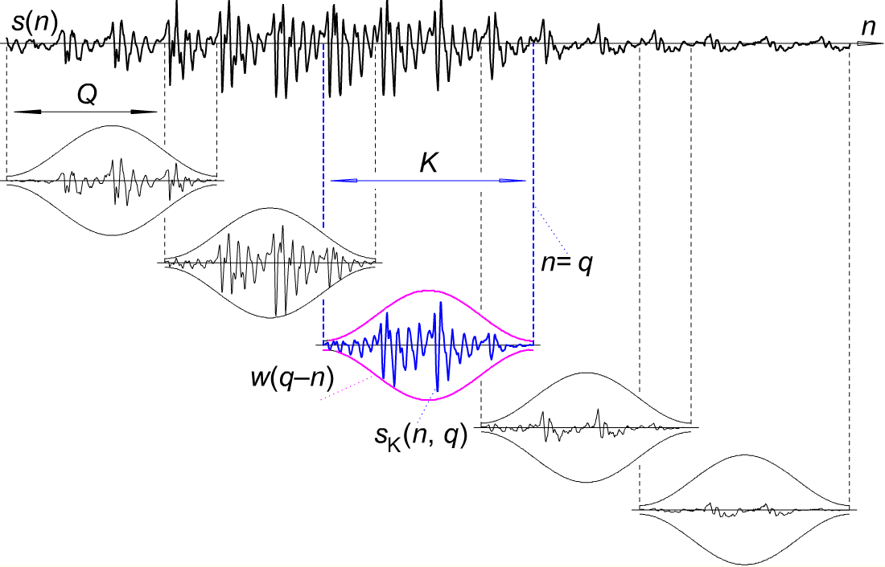
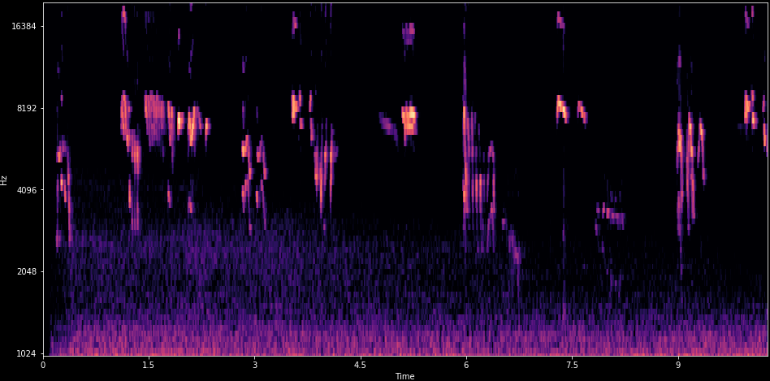
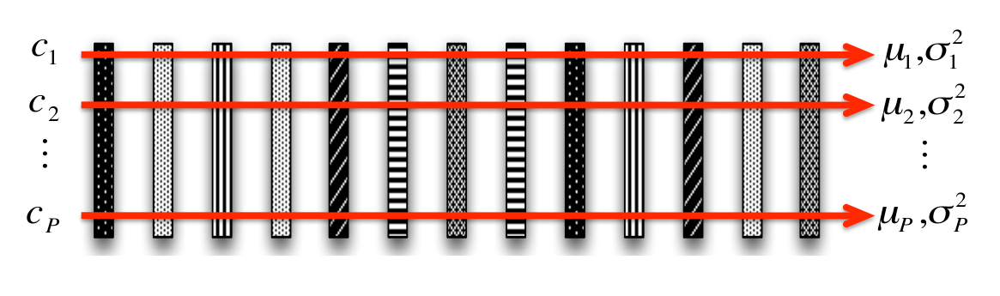
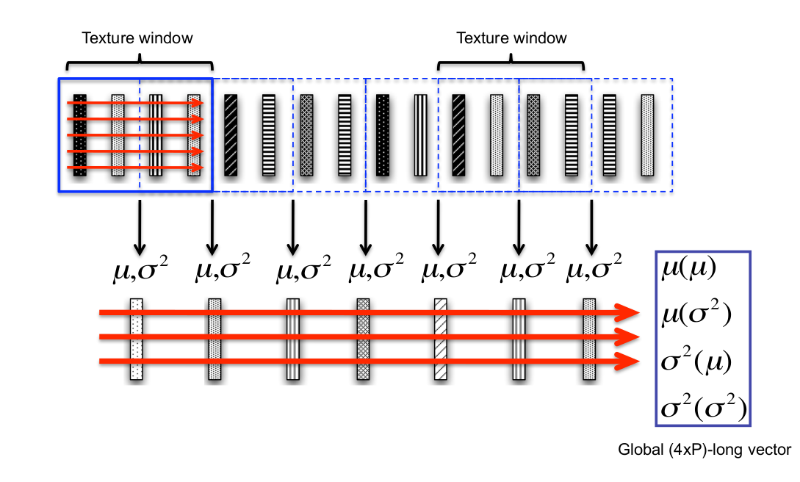

\newpage
# Introduction

Sound, and machine learning on sound, is a wide topic.
Some areas have enough interest to be considered their own fields.
This especially includes machine understanding of human speech (*Speech Recognition*) and
the computational analysis of music (*Music Information Retrieval*).

`TODO: recommend literature on Speech Recognition`
`TODO: recommend l. on Music Information Retrieval`

This paper instead focuses on detection and classification of *Acoustic Events*.
Such events can be any kind of sound, and in contrast to speech and music,
are often not produced with an intent to communicate.
Many of the techniques utilized for Acoustic Events can also be
used within speech and music, and many methods were in fact adopted from these fields.

While a basic understanding of the human auditory system can be beneficial when developing machine hearing,
coverage of Psychoacoustics will kept brief. Those interested in a detailed treatise on this subject can read [@].

`TODO: recommend book. Human and Audio` 

The paper assumes some prerequisite knowledge on machine learning.
In particular it is assumed that the reader:
knows the difference between supervised and unsupervised learning;
knows task formulations like Classification, Clustering and Regression;
basic familiarity with common methods like Support Vector Machines, Random Forests and Convolutional Neural Networks.

`TODO: recommend ML introduction`

Basic familiarity with Digital Signal Processing is assumed.
In particular knowledge of the Fourier Transform, digital filters and convolutions.

When it comes to acoustics and audio processing, neccesary information is provided in the Background section.
We will then cover the different aspects of Machine Learning for general Acoustic Event Detection. 
And at the end, we use the task of detecting the presence of birds as a practical example.

The case study uses the Python programming language, and the machine learning frameworks
scikit-learn and Keras. Prior familiarity with these tools will make it easier to
start applying the methods to tasks of your own.

In summary, the goal is that after reading this report:
a machine learning practitioner,
without prior knowledge about sound and digital audio processing,
is be able to solve basic Acoustic Event Detection problems.

## Applications
The application of machine learning to sound and acoustic events
can be found across many fields of scientific study and
in many industries.

`TODO: add references`

In security, detection of acoustic events are used to alert security camera operators to potential

In ecoacoustics, ...

In structural analysis, acoustic emissions is used to detect delamination of concrete on bridges

In domestic animal care, ...

In predictive maintenance, ...

In the smart home, acoustic sensors can detect and alert about baby crying or smoke alarm.

In natural disaster management, early warning systems for landslides uses acoustic sensors


In most application scenarios, sound is transmitted via the air.
However there are fluid-borne sound (hydrophony) and structure-borne sounds and vibrations. 
Some sounds are below the audible range for humans (infrasound) and some above (ultrasound).
The techniques presented here should apply in general across these modalities.


\newpage
# Background 


## Digital sound representations

.

    `FIXME: make/find better picture`

* Quantized in time (ex: 44100 Hz)
* Quantizied in amplitude (ex: 16 bit)
* N channels. **Mono**/Stereo
* Uncompressed formats: PCM .WAV
* Lossless compression: .FLAC
* Lossy compression: .MP3


In the Time-domain an audio signal is a continiously varying
signal corresponding to the pressure variation.


Waveform (time domain) of a frog croaking repeatedly.
Overall changes in signal intensity over time is visible,
but what pitches are present (if any) is not. 

Using the Fourier Transform, the audio can be losslessly converted to the frequency domain.


Spectrum (frequency domain) of same frog sample.
The frequency content can be seen, but

Using Short-Time-Fourier-Transform (STFT), the audio can be mapped to the Time-Frequency domain.


Spectrogram (time-frequency domain) of same frog sample.
Both temporal pattern and frequency patterns can be seen.

The STFT has a tradeoff in time/frequency resolution.
Multi-resolution STFT can be used if high resolution in both time and frequency is needed.


\newpage
# Problems formulations

## Classification

Return: class of this audio sample.
Samples can be short (1 second) or long (1 hour).
Classification can be binary (is this birdsong?), or multi-class (which species is this?).

When the classification is done on longer samples it is often called an Acoustic Scene Classification
instead of Acoustic Event.

## Event detection
Return: time something occurred.

* "Bird singing started", "Bird singing stopped"
* Classification-as-detection. Classifier on short time-frames
* Monophonic: Returns most prominent event

::: notes

Great summary of Sound Event Detection progress, 2010-2017.
f1 score 8.4% -> 70%. MFCC+HMM+Viterbi -> MFCC+HMM+NMF -> mel+DNN -> mel+CRNN 
http://www.cs.tut.fi/~heittolt/research-sound-event-detection0

:::

Can be extended to allow multiple events to happen at the same time (polyphonic event detection).
This can be approached using separate classifiers per 'track',
or using a multi-label classifier as a joint model.

## Audio segmentation

Return: Sections of audio containing desired class

Can cut the audio into pieces based on time-stamps from Event Detection. 

This can often be of interest for pre-processing of data.
For instance to avoid spending time further analyzing or labelling information
that is known to not be of interest.

## Weak labeling

Many acoustic events are short in duration, for instance a door slamming.
Other acoustic events only happen intermittently, like the vocalizations of bird singing.

Ideally each and every of these acoustic events would be labeled with a start and end time.
However due to the costly nature of labelling, often a time-based label is not availble,
only whether an event occurs at least once inside a clip.
This is called a 'weak label' or 'weakly annotated' data.

For classifications of entire audio clips this is not neccesarily a problem.
But when performing event detection, which must be done on small sets of frames,
the missing time information means there is not a direct label for this input.

Typically the learning is then formulated as a Multiple Instance Learning (MIL) problem.
Under MIL features/inputs are grouped into a 'bag', and the label is considered to be on the bag
and not the individual feature/inputs. MIL formulations exist for many common machine learning algorithms.


## Other problem formulations

In Audio Information Retrieval, a database of sounds is queried by providing or selecting an example sound.
Results should be sounds similar to the provided sound, and preferably ranked by their similarity.

Audio fingerprinting seeks to establish a unique fingerprint that is robust to transformations,
such that duplicates of an audio clip can be detected. 

Fingerprinting, retrieval and ranking is often based on a similarity metric.

In a Source Separation task, the goal is to output several track of audio,
each containing only a single source, with the other sources supressed.


\newpage
# Feature representations

`TODO: image of machine learning pipeline`

The samples of audio in the time-domain are


`TODO: sentence on why using raw audio as input is hard`

## Frames

To process and analyze audio data it is often represented as *frames*, small groups of samples across time.
Frames can be produced in real-time, by aquiring N samples at a time,
or by splitting up audio files after they have been recorded.

In a frame based approach, a frame is the smallest unit of time processed by the machine learning algorithm.
Therefore the frame length must be set long enough to contain enough relevant information,
but not so long that temporal variations disappear.

For speech, a choice of frame length might be 25ms.
`TODO: double-check`
`TODO: add number of samples`
Similar frame lengths are often adopted for acoustic events, unless there are specific concerns.


K=frame length, Q=hop length
`TODO: source for image`

http://www.nyu.edu/classes/bello/MIR_files/timbre.pdf


Frames often have overlapping samples at the start and end.
Without overlap, acoustic event that happens partially in one frame results in different signals than when appearing in the middle.
The overlap can be specified as percentage of the frame length (overlap percentage).
or as a number of samples (hop length). Overlap can for instance be 50%.
A window function is applied to ensure that the signal level stays constant also in overlapping sections.


## Low-level features

From the samples in each frame, features can be calculated.

[@Breebaart2004, Ch 2.1.1] defined a Low-Level feature set for audio classification as:

1. root-mean-square (RMS) level
2. spectral centroid
3. spectral bandwidth
4. zero-crossing rate
5. spectral roll-off frequency,
6. band energy ratio,
7. delta spectrum magnitude,
8. pitch and (9) pitch strength


Low-level features of birdsong. There are distinct peaks in the signals,
but how well they correspond to birdsong events is not immediately clear.

Of these, root-mean-square (RMS) and zero-crossing rate (ZCR)
are calculated directly on the samples in the time-domain.

The spectral features are computed using the Fourier Transform on a frame,
and then summarizing with standard statistics. See [@DonggeLi2001] for the definitions.

Low-level spectral features, being univariate statistics on the spectrogram,
removes a lot of the information present.

## Spectrograms

A raw Short Time Fourier Transform can contain 1024 or more bins, often with strong correlation across multiple bins.
To reduce dimensionality, the STFT spectrogram is often processed with a filter-bank of 40-128 frequency bands.
Some filter-bank alternatives are 1/3 octave bands, the Bark scale, Constant-Q transform and the Mel scale.
All these have filters spacing that increase with frequency, mimicking the human auditory system.

## Mel-spectrogram

The most popular filter-bank uses triangular filters evenly spaced on the Mel scale.
A spectrogram processed with such a filterbank is called a Mel-spectrogram. 

`TODO: add ref for popularity`
`REF: log mel-spectrogram highest performing and most popular DCASE2018 results`


Mel-spaced filters in filterbank. HTK version shown, unity gain center filters.
Another version exists with unit-area filters.



Mel-spectrogram of birdsong. The birdsong is clearly visible as up and down chirps at 3kHz and higher.


A mel-spectrogram can still have significant correlation between bands.

## MFCC

To reduce correlation one can compute the Discrete Cosine Transform (DCT-2) on the mel-spectrogram.
The result is known as the Mel Filter Cepstrum Coefficients (MFCC).


MFCC of birdsong.

Another advantage of the DCT is that important information in the signal tends to end up in the lower coefficients.
Therefore it can be compressed efficiently (but lossily) by dropping the higher coefficients. 13-20 coefficients is common.

However events that are close in frequency are no longer next to each other in a cepstrum,
making local pattern-matching algorithms less effective.
The MFCC is also harder for humans to evaluate, as the clear visual mapping to what can be heard is gone.


## Summarizing features

For longer segments of audio it is often desirable to
come up with a summary that represents the entire clip,
either for similarity metrics or for classification. 

This can be done by computing statistics across the features
for all frames in the clip.



`TODO: image reference`

Any statistical aggregate function can be used, such as
min,max,skew,Kurtosis,etc.

Second-order statistical summarizations by grouping frames, computing statistics per group,
and then statistics on the groups.
This is sometimes called *Texture windows*.



## Convolution

`TODO: examples of non-learned convolutional kernel, applied to spectrogram`
Standard: Vertical edge detector. Median filter. 
Customized: detect cascade up or down 

In this way, a convolutional kernel can be seen as a generalized local feature detector.


https://i1.wp.com/timdettmers.com/wp-content/uploads/2015/03/convolution.png?resize=500%2C193

Often a set of convolution kernels are used, and in combination they can detect many pattern variations.


https://www.researchgate.net/profile/Le_Lu/publication/275054846/figure/fig5/AS:294508295147530@1447227657495/The-first-layer-of-learned-convolutional-kernels-of-a-ConvNet-trained-on-superpixels.png


## Feature learning

To avoid having to manually design or chose convolution kernels, they can be learned from data.

One simple method is spherical k-means clustering on randomly selected spectogram patches.
`TODO: ref spherical k-means`
It uses the cosine distance `TODO: double check`, and the resulting kernel taken as the center of each cluster.
This has been shown to work well for birdsong classification.
`TODO: ref Stowell skm`
An alternative vector quantization method is Sparse Non-negative Matrix Factorization.
`TODO REF. "Feature Learning with Matrix Factorization Applied to Acoustic Scene Classification"`

Other unsupervised methods include and Convolutional AutoEncoders (CAE).
One can also apply convolution to the outputs of convolutions, to obtain a 'deep' model.

`TODO: ref Stacked Convolutional Auto-Encoders for Hierarchical Feature Extraction`

If large amount of labeled data are available, a Convolutional Neural Network (CNN)
can be used for supervised learning of deep network of convolution operators.

CNN models, with many variations, are currently among the best performing models both in 
in audio classification (as well as image classification). 
`TODO: ref for best perf`

## Learning on raw audio

While neural network models are typically applied to spectrogram as input features,
it is possible to train a deep neural network classifier that takes the raw audio as input.
This is often called 'end 2 end' learning.
`TODO ref`

In this case the network needs learn also learn something resembling the time-frequency decomposition
normally performed by the spectrogram, which increases the training time
and amount of training data needed.

It also brings the models further away from how image classification,
making it harder to utilize the ever-expanding amount of experience from machine learning on images.

Can be used in fusion with spectrogram model. `REF DCASE2018 submission` 

## Other feature representations
A large amount of alternative feature representations have been proposed.
Some have explored wavelet filterbanks and the Scattering transform.
`TODO: refs`

Prior to efficient convolutional neural networks, features like
Scale Invariant Feature Transform (SIFT) and Histogram of Oriented Gradients (HOG) 
were developed for images, and have also been applied to spectrograms.
`TODO: refs`

Models that more closely mimics the human hearing system include CARFAC.
`TODO: ref CARFAC paper`


# Pre-processing spectrograms

The difference in intensity between faintest sounds that humans can hear,
and the loudest before permanent damage is .... `TODO ref`.

To bring the values onto a more linear scale,
it is common to apply compressive transform.
Most common is log, but square-root and cubic-root can also be used.

*Spectral mean subtraction* is also common.
From each band, remove the mean of that band (along time axis).
`TODO ref`

The following two images demonstrate the usefulness of pre-processing on Mel-spectrograms.


Spectrogram with bird vocalization among other noise.
Hard to see where the birds appear.


Spectrogram after spectral mean subtraction and median filtering (3x3).
Bird chirps become more visible (in red), at around 1.4 seconds and 9.0 seconds.


\newpage
# Case study

As a concrete task to illustrate some of the above,

On DCASE2018 bird-detection challenge.

Some code will be provided inline for illustration.
The full code as executable Jupyter Notebooks is available at `TODO: link to repo`

## Bird vocalization detection

The problem formulation is binary classification:
the system should output whether audio sample has bird(s) or not.

* 10 second audio clips
* One label for the clip (weakly annotated)
* 3 training sets, 3 test sets
* Total 48'000 samples

The 2018 edition of this challenge is focused on generalizable performance.
Therefore 2 of the test sets are recorded at different locations with different equipment
than the training samples (mismatched conditions).


## Feature representations

As a basis for feature representations, the log-transformed mel-spectrogram is used.
The mel-spectrogram is calculated with 64 mel-filter bands, from 500Hz to 15000 Hz.
Exploration of the dataset showed that many recordings had a lot of static white-noise below approximately 1000Hz,
and not all recordings had data above approximately 16KHz.
Especially those from the remote monitoring scenarios (`PolandNFC`, `Chernobyl`) were affected.
The implicit assumption is that most or all of the bird vocalization is inside the preserved range.

The spectrogram is then preprocessed by removing the median per frequency band,
and finally it is min-max scaled to a range of 0-255, and converted to an 8 bit-unsigned integer.
This hopefully reduces variation between the different recording characteristics of the different datasets. 

`TODO: spectrogram image. Before+after 8-bit quantization?`

```python
def read_audio(url):
    f = urllib.request.urlopen(url)
    data = io.BytesIO(f.read())
    samplerate, samples  = scipy.io.wavfile.read(data)
    assert samplerate == 44100, samplerate
    data = samples.astype('float')/32768
    return samplerate, data

def melspec(data, sr, subtract='median', n_mels=64, fmin=500, fmax=15000, htk=True,):
    from librosa.feature import melspectrogram
    
    mel = melspectrogram(y=data, sr=sr,
                         n_mels=n_mels, fmin=fmin, fmax=fmax, htk=True)
    mel = librosa.core.amplitude_to_db(mel, ref=1.0)
    if subtract == 'median':
        mel = mel - (numpy.median(mel, axis=1, keepdims=True) + 1e-8)

    return mel

def quantize_8bit(s):
    out_min,out_max  = 0, 255
    in_min, in_max = s.min(), s.max()
    std = (s - in_min) / (in_max - in_min)
    scaled = std * (out_max - out_min) + out_min
    return scaled.astype(numpy.uint8)
```

For each file, the features can then be computed using

```python
sr, data = read_audio(wav_url)
mel = melspec(data, sr, n_mels=64)
mel = quantize_8bit(mel)
```

Using 8-bit unsigned integer allows to store the features compressed using standard image formats.
For lossless storage, the PNG format is used.


The features are pre-calculated for each of the 48'000 files and stored in Google Cloud Storage, as a public dataset.
`TODO: link to dataset`

`TODO: say something about compression rate`

A small Python module `dcase2018bird.py` was developed to have convenient access to the dataset.

`TODO: code example snippet`


## Compared methods

A couple of different machine learning pipelines was developed.
All use the same mel-spectrogram input. 

* `melspec-maxp-rf`: Max-summarization, RandomForestClassifier.
* `melspec-cnn-logreg`: Pretrained CNN, LogisticRegression classifier


No data augmentation was performed.


`TODO: write a bit about each model`
`TODO: import code for each model`

## Results

`TODO: accuracy for each model`

`TODO: say something about training time?`

# References

