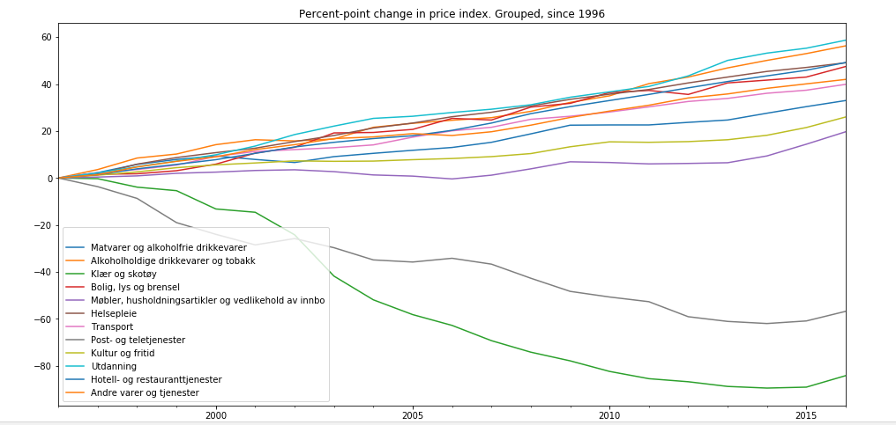

# Price changes in goods by category in Norway

Inspired by [ourworldindata.org: Price changes in consumer goods and services in the USA](https://ourworldindata.org/grapher/price-changes-in-consumer-goods-and-services-in-the-usa-1997-2017)

Note: image shows *percent-points* change, not percentage change.

## [Jupyter notebook](./Norway.ipynb)

## Data
From [ssb.no Statistikkbanken](https://www.ssb.no/statistikkbanken) 

* Tabell: 03014: Konsumprisindeks, etter konsumgruppe (2015=100)
* Choose 'Konsumgruppe': 'Hovedgruppenivaa'
* Select all groups
* Select all years
* Choose 'Lagre som': 'Semikolonseparert'

Snapshotted data available under [./data](./data) as a .csv file
