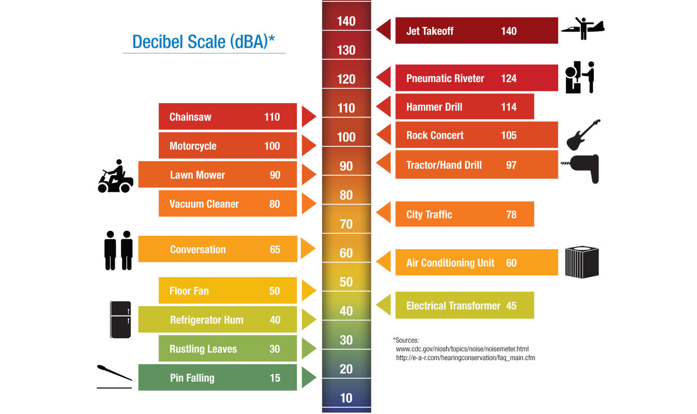
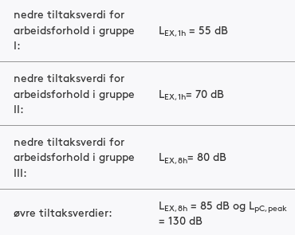
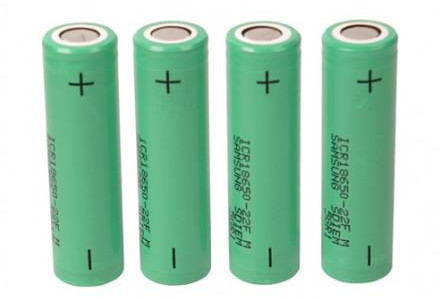

# Acoustic Noise

## Sound level

Normally A-weighted to simulate human hearing sensitivity.

::: notes
https://images-na.ssl-images-amazon.com/images/G/01/BISS/Aplus/3M/B00CPCHBCQ.PT04.300dpi._V377525867_.jpg
:::

## Equivalent Sound Level

Sound level, averaged over a time period **T**.

::: notes
https://proxy.duckduckgo.com/iu/?u=https%3A%2F%2Fwww.labour.gov.on.ca%2Fimages%2Fhs%2Fnoise_en.jpg&f=1
:::

## Occupational noise

> Noise experienced by workers 

**EU Directive 2003/10/EC - noise**

Covers everything from office work to industrial labor.

## Norwegian regulations

Forskrift om tiltaks- og grenseverdier $2-1, Arbeidsmiljøloven $4-4 

## Environmental noise

**EU Directive 2002/49/EC**

Covers residential areas.
Also relevant for hospitals, schools, kindergardens.

## Norwegian regulations

Buildings (Byggteknisk forskrift, NS 8175.2008)

* Leq_24h `< 30db` (new)
* Leq_24h `< 35dB/42db` (old) 

Environment (Forurensningsloven)

* Lden `< 55 dB`
* Lnight `< 50 dB`

WHO recommends Lnight < 40 dB(A)

::: notes
https://lovdata.no/dokument/SFO/forskrift/2010-03-26-489
http://www.stoyforeningen.no/Hva-er-stoey/Boligstoey-regelverk
http://www.lovdata.no/for/sf/md/xd-20040601-0931.html
:::

## Health impact

* Hearing impairment
* Reduced concentration
* Increased stress
* Sleep disturbance
* Increased blood pressure
* Heart problems

## Environmental noise in Europe

* Increasing problem
* Road traffic the biggest source
* 125 million affected by road noise above Lden=55dB
* 37 million road noise above Lden=65dB
* 56 million affected at night (Lnight>50dbA)

EEA: Population exposure to environmental noise, 30 Nov 2018

## Current state in Oslo/Norway

Statistikkbanken Oslo Kommune

:: notes

Minimum efforts wrt legislation.
! 2015 plan created "

http://statistikkbanken.oslo.kommune.no/webview/index.jsp?headers=r&Omrdesubset=1+-+15&stubs=Omrde&measure=common&virtualslice=Andel_value&layers=virtual&study=http%3A%2F%2F192.168.101.44%3A80%2Fobj%2FfStudy%2FTL-stille-omrader-prosent-areal&mode=cube&v=2&virtualsubset=Andel_value&Omrdeslice=1&rsubset=2006+-+2016&measuretype=4&rslice=2016&cube=http%3A%2F%2F192.168.101.44%3A80%2Fobj%2FfCube%2FTL-stille-omrader-prosent-areal_C1&top=yes

::

# Noise measurements

## Personal dosimeter

`TODO: picture`

Standard: IEC 61252 Ed1.1 (2002-03), Personal Sound Exposure Meters

## Sound Level Meters

`TODO: picture`

Standard: IEC 61672-1 2003, Sound Level Meters

## Continious monitoring

`TODO: picture`

Price: 2'000 EUR+

# Project

## Problem statement

> Design a wireless sensor node for environmental noise monitoring.

* Running only on battery power
* Does not require user-provided network 
* Ability to identify noise source

# Requirements

## Costs

* Unit production costs. **<1000 NOK**
* Installation. **<1000 NOK**
* Running costs. **<1000 NOK/year**

## Sound Level Measurements

* Continious sound level monitoring. **LAeqT**
* Tolerance should be within **IEC 61672, Class 2** 
* Measurement resolution: **per minute** or better
* Latency: **Reported daily** or more often

## Physical

* Weatherproofing grade. **IP55+** (IEC 60529)
* Temperature tolerance. Operational: **-10C to +40C**
* **Easily mountable** on flat surface, such as a wall.
* **Aestethically acceptable** for office/restaurant/home

# Design

## Hardware architecture

Total power consumption: **<1mA**

## Energy source

1mA@365 days = 8760 mAh. 4x18650 = 12800 mAh

::: notes
Battery size: 68x72x18 mm
Total unit: ~100x100x25 mm
:::

## Bill of Materials

`TODO: display BOM`

## Connectivity

Using 2G/GPRS or 4G/NB-IoT

$Leq_{minute}$: 1 440 bytes/day
$Leq_{sec/8}$: 691 200 bytes/day

`TODO: estimate power consumption`

## Software architecture

SoundLevel is continuous, NoiseIdentification on-demand.

## Microphone response

IP55 rated elecret mic. Looks to be within Class 2.

# Prototype

## Proto1

* Based on Nordic Thingy52 devkit
* BLE4.2 + GPRS modem
* Digital MEMS microphone. Not Class2
* 1400mAh battery.
* CNC milled enclosure. IP22

# Conclusions

## Feasibility

## Learned

* Need very big batteries for always-on measurements
* Unable to provide *Short Leq* (8 per second) measurements
* Microphone consumes majority of energy!
Can one do periodic sampling? As a mode?

# Bonus

## Technical TODOs

* Firmware: `Leq` calculation
* Firmware: Transmit using 2G modem
* Switch to proper microphone, analog preamp
* Validate power consumption
* Proof-of-concept noise identification

## Market TODOs

Market research for different segments

* Restaurants/hotels/AirBnB 
* Schools/kindergardens/hospitals
* Road/rail/construction/industry
* Consumers experiencing noise (road/rail etc)

## Energy harvesting

Possible through external power connector.

* Solar/wind power
* Streetlights

## Other usecases

For acoustic sensors

* Traffic estimation
* Structural montoring
* Predictive maintenance

