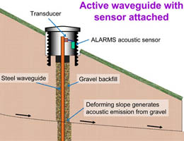

# Motivation

## Why Accoustic Sensors

Most physical processes emit sound
Infrasound and ultrasound
Structure borne, fluid borne
Non-invasive

## Why Machine Learning

Convert data into information
Analysis by skilled human does not scale

`TODO: `

## Why Sensor Networks

Continious monitoring
Integrated with other systems
Collect training data for ML 

## Why Wireless

Ease of placement
Cheap to install

# Applications

`TODO: fill out this section with usecases`

## Noise management in urban environments

EU regulation

## Protecting animals from poachers

Gunshots
Chainsaw

## Pasient care

## Alerts for Security cameras

## Early warning systems for natural disasters

Acoustic sensor for landslide detection. Loughborough University, 2010.

::: notes
https://www.lboro.ac.uk/service/publicity/news-releases/2010/164_ALARMS.html
:::

# Challenges

## Training data for machine learning

Transfer learning
Unsupervised pre-training

## Data rates

`TODO: picture of size of audio data, size of information` 

## Wireless connectivity

Narrowband-IOT
2-3G fallback

Keep install cost down
Zero-configuration
No custom network/gateways

## Privacy

## Energy sources

Solar power
Harvest from existing appliances. IE streetlights

