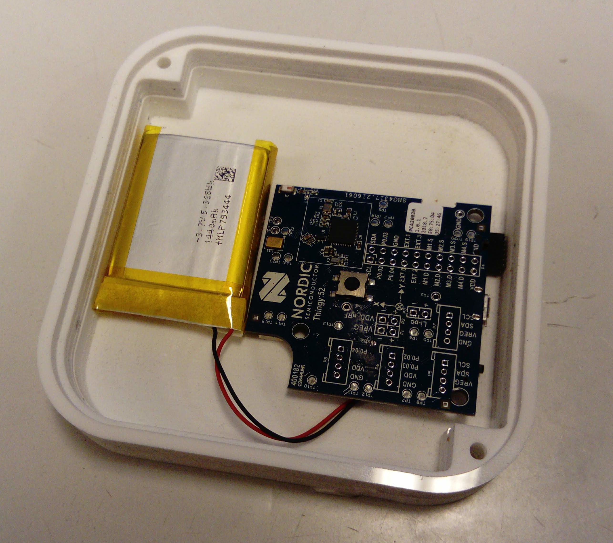

\newpage
# Introduction

## Background

### Environmental noise

`TODO: include two-liner definition`

### Health impact

Noise pollution is a major environmental health problem in Europe.

Environmental noise causes approximately 16 600 premature deaths in Europe each year,
with almost 32 million adults suffering from annoyance and over 13 million suffering sleep disturbance.
The WHO has identified noise as the second most significant environmental cause of ill health in western Europe,
the first being air pollution.

Road traffic is the most widespread source of environmental noise,
with more than 100 million people affected by harmful levels in the EEA-33 member countries.
Noise from railways, air traffic and industry are also important sources of noise.

Ref [@EuNoiseSources]

The various directives for common noise sources:
Road traffic noise, Aircraft noise, Railway noise, Noise from Equipment for Use Outdoors

Population exposure to environmental noise
https://www.eea.europa.eu/data-and-maps/indicators/exposure-to-and-annoyance-by-2/assessment-2
Published 19 Jul 2018.
Based on country submissions and redeliveries of the 2012 round of reporting,
eceived by the EEA at the end of March 2017.

The European Union's Seventh Environment Action Programme (7th EAP) sets the objective that by 2020
noise pollution in the EU will have significantly decreased,
moving closer to World Health Organization (WHO) recommended levels. 

The WHO has set a Night Noise Guideline level for Europe at 40 dB Lnight.

`TODO: mention impact on concentration/learning`

"Health implication of road, railway and aircraft noise in the European Union"

Environmental Noise Guidelines for the European Region – Executive summary (2018)
http://www.euro.who.int/en/health-topics/environment-and-health/noise/publications/2018/environmental-noise-guidelines-for-the-european-region-executive-summary-2018
Environmental Noise Guidelines for the European Region (2018)
http://www.euro.who.int/en/publications/abstracts/environmental-noise-guidelines-for-the-european-region-2018
Now includes "leisure noise". Lnight down to 44dBA. EU still tracking

### Regulations

Environmental noise is regulated by EU directive 2002/49/EC[@EuNoiseDirective].

* the determination of exposure to environmental noise
* ensuring that information on environmental noise and its effects is made available to the public
* preventing and reducing environmental noise where necessary
and preserving environmental noise quality where it is good

The Directive requires Member States to prepare and publish noise maps and noise management action plans every 5 years for:

* agglomerations with more than 100,000 inhabitants
* major roads (more than 3 million vehicles a year)
* major railways (more than 30.000 trains a year)
* major airports (more than 50.000 movements a year, including small aircrafts and helicopters)

When developing noise management action plans, Member States' authorities are required to consult the concerned public.

The Directive does not set limit or target values, nor does it prescribe the measures to be included in the action plans.
This is at the discretion of the individual Member State authorities.

However, EU have defined  *indicators* for noise pollution.

Environmental Noise Directive (END)

$L_{den}$: Designed to assess annoyance.
It refers to an annual average day, evening and night period of exposure.
Evening are weighted 5 dB(A) and a night weighting of 10 dB(A). 
$L_{night}$: Designed to assess sleep disturbance.
It refers to an annual average night period of exposure.

Lden: day-evening-night, 55dB
Lnight: night, 50dB

`TODO: include equations`

In Norway, the coverning legislation for noise pollution is [@Forurensningsloven],
which implements the EU directive.

### Noise measurements

Standards

    IEC 61672-1 : 2003. Sound Level Meters. Class 2, Class 1.

    IEC 61252:1993 +AMD1:2000 Personal Sound Exposure Meters
    IEC 61252 Ed 1.1 (2002-03) Personal Sound Exposure Meters
    ANSI S1.25:1991 (R2017) Personal Noise Dosimeters

### Noise monitoring
Continious

Wireless Sensor Networks.

### Noise source identification

Sound level meters often report sound levels in octave bands or 1/3 octave bands.

    IEC 61260-1:2014 Class 2 (Octave Bands from 63Hz to 8kHz)
    ANSI S1.11-2014 Class 2 (Octave Bands from 63Hz to 8kHz)

This information can be used by a competent acoustician to understand the character
of the noise, and to plan noise reduction improvements.

Machine learning can be used to classify sounds into classes.
`TODO: include source`

### Who may want to track noise

The noise pollutants,
to ensure compliance with noise regulations and protect against false accusations.

* Operators of road, railroad, airports and ports
* Construction and industry companies
* Hotel and apartment managers. Ensure guests dont cause too much noise.
* Restaurants, bar and club managers

Those affected by noise pollution.

* House owners
* Workers
* Pedestrians and bicyclists

Service operator where noise pollution can be an issue for users of service.

* Hospitals
* Schools, kindergarden
* Municipalities
* Departments for roads and infrastructure

### Current situation in Norway and Oslo

For Norway.

* 100k people too much noise from railway
* 900k people too much noise from road day-evening-night, 500k at night
* 200k are sleep disturbed or highly sleep disturbed 
* Trends. "Oslo Data not provided or unsuitable for deriving trends" !!

https://www.eea.europa.eu/themes/human/noise/sub-sections/noise-fact-sheets

Per-country summarizations of noise situation. In 2017

`TODO: describe to which degree monitoring is done today`

Forskrift om begrensning av støy i Oslo kommune, Oslo
https://lovdata.no/dokument/OV/forskrift/1974-10-09-2
Last changed 2015.
Table 1: Allowed noise levels for construction work

"Tilgjengelighet og støynivå skal kartlegges hvert femte år i de stille områdene. Neste kartlegging er planlagt i 2021."

https://www.oslo.kommune.no/politikk-og-administrasjon/statistikk/miljostatus/trafikkstoy-og-stille-omrader/
14 designated quiet areas.

Handlingsplan mot Støy 2018-2023, Oslo Kommune.
https://www.oslo.kommune.no/getfile.php/13300984/Innhold/Politikk%20og%20administrasjon/Milj%C3%B8%20og%20klima/Handlingsplaner%20og%20strategier/Handlingsplan%20mot%20st%C3%B8y%20i%20Oslo%20byomr%C3%A5de.pdf

- Oslo Sporveiene: Utviklet måleprogram for støyovervåking. Årlig siden 2007
- Som del av kommuneplan 2015 er det i Oslo vedtatt avvikssoner for støy. Dette åpner for boligbygging i støyutsatte områder. Rød støysone. 
- Mangler prognoser for trafikkøkning og forventet økning i antall støyutsatte, basert på dagens handlingsplan
- Inspill: For lave ambisjoner mhp. stille områder i Oslo.

Oslo Kommune 2013 report

- 754 skole- og barnehagebygg har støynivåer fra veitrafikk over anbefalt grense på 55 dB,
hvorav 173 slike bygninger har svært høye støynivåer (over 65 dB).
- 103 skole- og barnehagebygg har støy fra skinnegående trafikk over 55 dB,
og 24 bygg har over 65 dB.

Oslo Kommune statistics on noise. Wrt quiet areas, educadtional building

http://statistikkbanken.oslo.kommune.no/webview/index.jsp?headers=r&Omrdesubset=1+-+15&stubs=Omrde&measure=common&virtualslice=Andel_value&layers=virtual&study=http%3A%2F%2F192.168.101.44%3A80%2Fobj%2FfStudy%2FTL-stille-omrader-prosent-areal&mode=cube&v=2&virtualsubset=Andel_value&Omrdeslice=1&rsubset=2006+-+2016&measuretype=4&rslice=2016&cube=http%3A%2F%2F192.168.101.44%3A80%2Fobj%2FfCube%2FTL-stille-omrader-prosent-areal_C1&top=yes

Oslo Havn støy
https://www.oslohavn.no/no/miljo/miljo_i_havna/stoy/
Yearly noise reports. Made by Sweco.
2 sensor stations. Monthly/week plots available
! data ends in July 2018?
http://www.akustikk.info/bekkelagsskraningen/uke_kveld.htm
http://www.akustikk.info/ormoya/mnd_dag.htm

### Existing solutions

There are a number of commercially available products for continious noise monitoring.
For outdoor monitoring for industrial and smart-city usage [@CesvaTa120], [@NorsonicNor1531], [@UrbioticaUSound],
[@ScantekScanmonitor], [@RionNa37a] and [@SoundEar320x].
Of these only the SoundEar3-320X has pricing available,
stating that it is the "most affordable external noise monitoring with system prices starting from €2,000".

Fewer products seem to be dediated for continiously indoor noise monitoring alone,
however some "weather station" devices also support sound level (in addition to temperature, humidity and air quality). 
Examples include Netatmo Homecoach [@NetatmoHomecoach] and Archos WeatherStation [@ArchosWeatherStation].

One of the few noise sensor companies that explicitly target consumers is NoiseAware [@NoiseAware].
They provide an indoor sensor which plugs into a mains power socket and communicates over over WiFi,
and an outdoor unit, which is battery powered and communicates via the indoor unit.
As of this time, their units are available for preorder in USA, with international launch "planned for 2019".
The indoor sensors costs 199USD per unit, and the outdoor unit an additional 99USD.
To utilize the sensor, one must also have a subscription at 99USD/year.

In addition to commercial products, a number of research projects have deployed sensor networks for acoustic noise.
This includes [@Sonyc] in New York City, and the Sentilo project in Barcelona. `TODO: source`

## Problem statement

Design a sensor node for environmental noise monitoring,
that takes part in a wireless sensor network.

The device must be able to measure sound level continiously
and log the measurements to a centralized system.

The system should allow to alert interested parties when sound level exceeds define threshold.

The captured data should include neccesary information to help identify the source noise pollution.

\newpage
# Specifications

## Requirements

As a basis for Sound Level Measurements and Environmental protection
the Barcelona noise sensor specification[@BarcelonaSoundSensorSpecification] is used.

Legal

* Designed-for-privacy. Unable to record peoples conversations.

Costs

* Unit production costs `<1000 NOK`
* Installation. `<1000 NOK`
* Running costs. `<1000 NOK/year`

Sound Level Measurements

* Must transmit: Continuous sound level weighting A (LAeqT) in dB(A)
* Frequency weighting: Frequency weighting A, according to 61672-1
* Integration time. Min 1 second - max 1 minute
* Tolerance. From 10Hz to 20kHz, maximum allowed variance LAeq±2dB(A) and/or compliance to
Class 2 limits according to IEC 61672-1.
* Measurement range. Minimum from 40 to 90 dB(A)

Environmental protection

* Weatherproofing grade. IP55+ (IEC 60529)
* Temperature tolerance. Operational: -10C to +40C
* Microphone protection. Windscreen, wind/rain, birds

Physical characteristics

* Mountable on flat surface, such as a wall.
* Size. Under 100x100x30 mm
* Weight. Under 500gram.
* Aestethics. Designed such that homeowners are willing to have it on their wall

Reporting latency

* Measurements updated at least daily.
* Alerts must be given within the hour.

Monitoring

* Sends battery level.
* Sends wireless reception level.
* Sends error log

Updateable over-the-air

* Sensor processing parameters can be updated.
* Sensor firmware can be updated.
* Any machine learning models can be updated.

## Desirable

It is desirable that the system can be extended to support related usecases.

- External microphone input.
- Temperature/humidity sensor. Can be used to compensate for sound. Battery monitoring needs temp.
- Accelerometer. Can be used to compensate sound, and record structure born vibration.
- Can optionally collect raw data, as training data for machine learning.
- Solar irradiance. Could be used to estimate/plan possible future solar-powered system/extension

\newpage
# Design

## System architecture
A Wireless Sensor Network consistems of many sensor nodes that communicate to a central service.
There are many possible wireless technologies available, from 

`TODO: architecture overview diagram`

To minimize the install costs, the proposed design uses the standard cellular network,
and no custom gateway devices. The network can be 2G with GPRS data connectivity,
or 4G with NB-IoT connectivity.

## Data management platform

The sensor node periodically communicates measurements to the central system over HTTP(S) or MQTT(S).
This system creates aggregate statistics over longer time-periods and from multiple sensors.
A graphical user interface allows users to query these statistics, and see status of the sensor devices.

Pre-made platforms for noise data exist, including Sentilo,
an open-source platform developed and used by city of Barcelona since 2013.

`TODO: ref`
http://www.sentilo.io/
https://github.com/sentilo/sentilo

## Power source

`TODO: include calculations. power budget, battery size`

Primarily battery-powered. Can run only on battery for 1 year+. Rechargeable.

Advantages.

- Simple install, power source not needed.
Energy harvesting like solar panels. Could get in conflict with other requirements.
Solar panels towards the sun. In an area away from.
At angle, avoid catching snow/leaves/dust.

- Simple design requirements. power budget given by battery capacity.
Energy harvesting depends on installation site. Indoor/outdoor

Challenge
- ultra-low-power design needed
- limits possible data transmission and signal processing. 

Disadvantage
- Does not last forever. Needs charging.
Would be a dealbreaker in rural settings.

Mitigation.
Also allow external low-voltage input (5-24V).
Add-ons for outdoor solar, indoor solar. Off-the-shelf or third-party.

## Connectivity

`TODO: define date-rate needed`

WiFi, cellular.

! WiFi needs an existing network. And a way to configure credentials.
! cellular is zero configuration (for end user). But costs NNN per month

Bluetooth only relevant as an intemediate, for gateways.

`TODO: decide if we can have both`

## Data processing

In firmware

* Adjustable data thinning. Parameter. Based on battery / power drain. 
* Adaptive sampling. Sample noise details when noise level is high.

### Noise source identification using machine learning

When the sound level exceeds a configured threshold,
the sensor will collect more detailed information that can be
used to automatically identify the noise source.

The noise profile data is based on the 1/3 octave band, commonly used in acoustic measurements.
It has been shown that this can be used by a machine learning system to distinguish different noise sources. 
`TODO: import source`
They also show that when frequency spectrum samples are performed 10 times per second or more seldom,
it is not possible to understand any conversations. This preserves the privacy requirement.

## Electronics

 

Power switch.
Indicator LEDs

`TODO: bill of materials`

## Physical

To make a sensor unit that could fit into an office or home,
a custom designed case was prototyped. In small scale this can be CNC machined,
and at larger scales it can be injection molded.

The overall dimensions when fitting the 4x18650 batteries is 100x100x25 mm.
The prototype shown only has height=20mm.

## Installation

Prototype can be attached to any flat surface of more than 100mm using 2 screws.
For medium-term indoor uses it can also be attached using double-sided tape.

Example deployments scenarios inside

* In ceiling in office, mics down.
* On wall in industrial space, mic sideways

Example deployment scenarios outside

* Hanging from streetlamp, mics down
* Placed on streetlight pole, mics sideways
* On a moving vechicle used for noise mapping. Bus

To enable the sensor, installer only needs to switch the on button.
Immediately on power-on the sensor will transmit, allowing to verify data transmitted to sensor hub.
The installer can then update the location of the sensor on the map, and add documentation
about its exact placement.
This process should be easy enough that consumers can perform installation themselves.

# Conclusions

`TODO`

* Summarize features, main design choices
* Summarize costs
* Evaluate feasibility
* Evaluate suitability wrt requirements

# References
