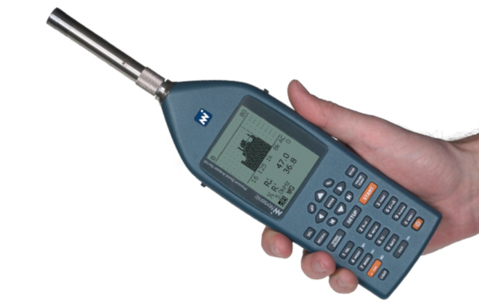
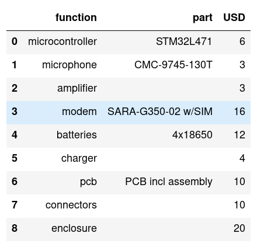
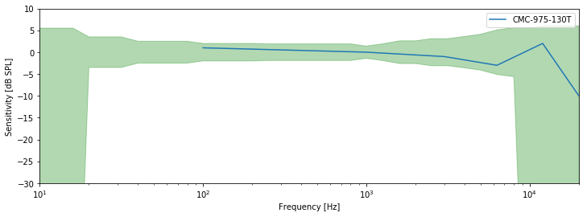
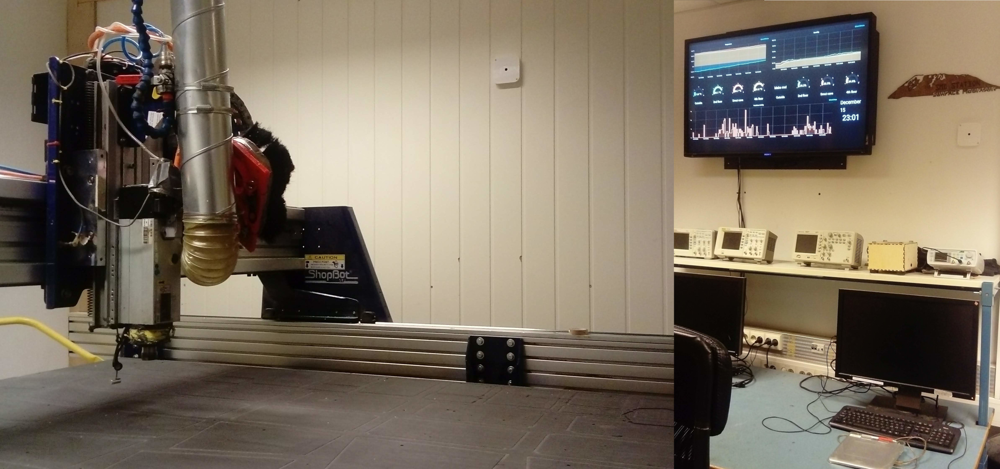

\newpage
# Introduction

## Definitions

### Environmental noise
Noise is unwanted sound. Environmental noise is the summary of noise pollution from outside,
caused by transport, industrial and recreational activities.
Road traffic is the most widespread source of environmental noise in urban environments.

### Sound level
Sound level is measured in decibel (dB).
0dB is the threshold of hearing, at $20 µPascal$ relative sound pressure. 
The level is normally A-weighted, which simulates the frequency response of human hearing.

### Equivalent Continious Sound Level
The sound level is constantly changing.
To get a single number representation, the sound level is averaged over a time period **T**.

\newpage
## Background

### Regulations
Environmental noise is regulated in the EU by the Environmental Noise Directive (2002/49/EC)[@EuNoiseDirective].
The purpose of the directive is to:

* determine peoples exposure to environmental noise
* ensuring that information on environmental noise and its effects is available to the public
* preventing and reducing environmental noise where necessary
* preserving environmental noise quality where it is good

The Directive requires Member States to prepare and publish noise maps and noise management action plans every 5 years for:

* agglomerations with more than 100,000 inhabitants
* major roads (more than 3 million vehicles a year)
* major railways (more than 30.000 trains a year)
* major airports (more than 50.000 movements a year, including small aircrafts and helicopters)

The Directive does not set limit or target values, nor does it prescribe the measures to be included in the action plans.
This is up to authorities of each individual Member State.

However, Environmental Noise Directive defines *indicators* for noise pollution:

$L_{den}$: Designed to assess overall annoyance.
It refers to an annual average day, evening and night period of exposure.
Evening are weighted 5 dB(A) and a night weighting of 10 dB(A).
Indicator level: 55dB(A).

$L_{night}$: Designed to assess sleep disturbance.
It refers to an annual average night period of exposure.
Indicator level: 50dB(A).

In Norway, the coverning legislation for noise pollution is Forurensningsloven[@Forurensningsloven],
which implements the EU directive.

### Health impact

According to European Commission introduction on the Health effects of Noise [@EuNoiseHealthEffects],
Noise pollution the second environmental cause of health problems in Europe, after air pollution.

Sleepers that are exposed to night noise levels above 40dB on average throughout
the year can suffer health effects like sleep disturbance and awakenings.
Above 55dB long-term average exposure, noise can trigger elevated blood pressure and lead to ischaemic heart disease.
The WHO has set a Night Noise Guideline level for Europe at 40 dB $L_{night}$.

According to a report done on behalf of the European Commision[@RVIMTransportationNoise]

"The exposure to transportation noise in Europe led in 2011 to about
900 thousand cases of hypertension and 40 thousand hospital admissions due to cardiovascular disease and stroke"
and "the number of cases of premature mortality due to these diseases as a result of noise exposure is about 10 thousand per year.",
and "An estimated 8 million people experience sleep disturbance due to transportation noise and about 4 million perceive this as severe".

### Noise measurements

Periodic noise measurements can be done with hand-held Sound Level meters.
Their specifications are standardized in IEC 61672-1 Sound Level Meters[@IECSoundLevelMeters].
Use of a handheld device requires an operator to be present, which limits how often
and at how many locations measurements are made.

Specifically for workplace monitoring, and evaluating risk of hearing impairment
noise dosimeters are also used. They are standardized in IEC 61252 Personal Sound Exposure Meters[@IECPersonalSoundExposureMeters].
These are not used for evaluating environmental noise.

With a continous noise monitoring station, measurement are be done automatically,
giving very good coverage over time.
Many such stations can be deployed to also give good spatial coverage,
operating together in a Wireless Sensor Network.

### Who may want to track noise

The noise pollutants,
to ensure compliance with noise regulations and protect against false accusations.

* Operators of road, railroad, airports and ports
* Construction and industry companies
* Hotel and apartment managers. Ensure guests dont cause too much noise.
* Restaurants, bar and club managers

Those affected by noise pollution.

* House owners
* Workers
* Pedestrians and bicyclists

Service operator where noise pollution can be an issue for users of service.

* Hospitals
* Schools, kindergarden
* Municipalities
* Departments for roads and infrastructure

### Existing solutions

There are a number of commercially available products for continious noise monitoring.
For outdoor monitoring for industrial and smart-city usage [@CesvaTa120], [@NorsonicNor1531], [@UrbioticaUSound],
[@ScantekScanmonitor], [@RionNa37a] and [@SoundEar320x].
Of these only the SoundEar3-320X has pricing available,
stating that it is the "most affordable external noise monitoring with system prices starting from €2,000".

Fewer products seem to be dediated for continiously indoor noise monitoring alone,
however some "weather station" devices also support sound level (in addition to temperature, humidity and air quality). 
Examples include Netatmo Homecoach [@NetatmoHomecoach] and Archos WeatherStation [@ArchosWeatherStation].

One of the few noise sensor companies that explicitly target consumers is NoiseAware [@NoiseAware].
They provide an indoor sensor which plugs into a mains power socket and communicates over over WiFi,
and an outdoor unit, which is battery powered and communicates via the indoor unit.
As of this time, their units are available for preorder in USA, with international launch "planned for 2019".
The indoor sensors costs 199USD per unit, and the outdoor unit an additional 99USD.
To utilize the sensor, one must also have a subscription at 99USD/year.

In addition to commercial products, a number of research projects have deployed sensor networks for acoustic noise.
This includes SONYC[@Sonyc] in New York City, and the Sentilo[@Sentilo] project in Barcelona.

\newpage
## Problem statement

To enable a more widespread deployment of continious monitoring systems:

Design a sensor node for environmental noise monitoring,
that is substantially cheaper than existing offerings.

The device must be able to measure sound level continiously
and log the measurements to a centralized system.
The system should allow alerting when sound level exceeds define threshold.

Additionally, it is desirable to be able to indicate the sources of noise pollution.

\newpage
# Specifications

## Requirements

Legal

* Designed-for-privacy. Unable to record peoples conversations.

Costs

* Unit production costs `<1000 NOK`
* Installation. `<1000 NOK`
* Running costs. `<1000 NOK/year`

Sound Level Measurements

* Must transmit: Continuous sound level weighting A (LAeqT) in dB(A)
* Frequency weighting: Frequency weighting A, according to 61672-1
* Integration time. Min 1 second - max 1 minute
* Tolerance. From 10Hz to 20kHz, maximum allowed variance LAeq±2dB(A) and/or compliance to
Class 2 limits according to IEC 61672-1.
* Measurement range. Minimum from 40 to 90 dB(A)

Environmental protection

* Weatherproofing grade. IP55+ (IEC 60529)
* Temperature tolerance. Operational: -10C to +40C
* Microphone protection. Windscreen, wind/rain, birds

Physical characteristics

* Mountable on flat surface, such as a wall.
* Size. Under 100x100x30 mm
* Weight. Under 500gram.
* Aestethics. Designed such that homeowners are willing to have it on their wall

Reporting latency

* Measurements updated at least daily.
* Alerts must be given within the hour.

Several of the requirements in sections Sound Level Measurements and Environmental protection are imported from
the specifications for noise sensor in Barcelona[@BarcelonaSoundSensorSpecification].

\newpage
# Design

## Electronics

 

The selected microphone requires 0.5mA, the STM32L4x1 microcontroller 0.25 mA in always-listening mode.
Amplifier and other supporting circuitry is estimated to 0.10mA.
With a 1mA total energy budget, this leaves 0.15mA average for data transmission.

Total component cost is 84 USD, ~750 NOK.
This is below the 1000 NOK target with some margin.

\newpage
## Power source

With a 1mA energy budget and minimum 1 year lifetime,
the power source needs to supply 1mA@365 days = 8760 mAh.

4x standard 18650 Li-ion have 4*3200 mAh = 12800 mAh capacity.
Taking into account 3% self-discharge per month this
should have more than 9000 mAh usable power over a 12 month period.

By integrating a charging circuit, the device can be charged
with common phone charger with Micro USB Type-B connector.
Charging time is estimated to be 24 hours at 500mA.

To optionally allow for a continious deployment without needing recharging,
the device also has an external 12-24V power input.
This could be a solar panel energy harvesting system,
mains power or low-voltage from other sensor systems deployed together. 
The batteries would then act like a buffer
and backup for disruptions in the primary energy supply.

\newpage
## Connectivity
The sensor sends measurements periodically to central service via wireless network.
To minimize the install costs, the proposed design uses the standard cellular network,
and no custom gateway devices.

The modem is normally off, powering and connecting to the network a few times
per day to upload data.

Using SARA G350 module with 2G/GPRS and COM4.no provider, the monthly fees are 12 NOK.
The module specifies 300 mA when transmitting. With estimated 10 second network registration time,
22kbit/second effective upload rate, and 1 data upload per day, the current draws can be seen in the table below.

| Type  | Data/day | Cost/month | Current draw |
| ------- |:-------:|-----:|-----:|
| Leq minute | 1.5 kB | 13 NOK | 0.04 mA |
| Leq sec/8 | 691.2 kB |  51 NOK  | 1mA |

With a power budget at 0.15mA, minute-wise data can be achieved.
The surplus energy can be used for computing and transmitting noise source identification data.

However the much more detailed 1/8 second data is out of the budget by factor of 6.
Additionally the 691 kB is too large to fit in FLASH storage, so it would
be neccesary to send more than once per day.

An upcoming alternative to 2G is the 4G technology LTE Cat NB1 "NB-IoT".
Telenor offers NB-IoT with 5 MB/year for 99 NOK, which is enough for a whole year of minute wise data.
The SARA N211 module for NB-IoT specifies transmit currents of 75-220mA (depending on transmit strength),
which should give some power savings.

\newpage
## Data processing

The firmware needs to capture microphone input continiously,
and from this compute the `Leq` sound level.
This processing is specified by IEC Sound Level meter standard[@IECSoundLevelMeters].
For the STM32 platform, the provided Sound Meter Library[@STM32SoundMeterLibrary] can be used.

### Noise source identification

When the sound level exceeds a configured threshold,
the sensor will collect more detailed information that can be
used to automatically identify the noise source.

The noise profile data is based on the 1/3 octave band, following the standard IEC 61260-1:2014[@IECOctaveBands].
This can be used by a machine learning system to distinguish different noise sources[@AudioCodingSensorGrid].
The paper also demonstrates that when frequency spectrum samples are performed 10 times per second or more seldom,
it is not possible to understand conversations. This preserves the privacy requirement.

To avoid using too much energy, the noise identification trigger has an upper limit
on how often it will record noise profiles.

\newpage
## Microphone

The microphone is the most critical component to ensure high quality acoustic measurements.
Additionally the microphone is the most sensitive component with respect to environmental protection,
as it needs to be protected against water and dust without impacting acoustic performance.
For that reason an IP55 rated microphone was selected, the CMC-9745-130T.

While the microphone looks to be within the Class2 standard for frequency tolerance,
it remains to be tested that the entire system can meet the standard.

\newpage
## Physical

To make a sensor unit that could fit into an office or home, a custom enclosure was designed and prototyped.
In small scale this can be CNC machined, and at larger scales it can be injection molded.

The overall dimensions required for fitting the 4x 18650 batteries is 100x100x25 mm.
Note that the prototype shown only has height=20mm.

\newpage
## Installation

The designed enclosure can be attached to any flat surface of more than 100mm using 2 screws.
For medium-term indoor uses it can also be attached using double-sided tape.

Example deployments scenarios inside

* In ceiling in office, mic down.
* On wall in industrial space, mic sideways

Example deployment scenarios outside

* Hanging from streetlamp, mics down
* Placed on streetlight pole, mics sideways
* On a moving vechicle used for noise mapping. Bus

To enable the sensor, installer only needs to switch the on button.
Immediately on power-on the sensor will transmit, allowing to verify that data is transmitted to the sensor hub.
The installer can then update the location of the sensor on the map, and add documentation about its exact placement.
This process should be easy enough that many consumers can perform installation themselves.

\newpage
## Data management platform

The sensor node periodically communicates measurements to the central system over HTTP(S) or MQTT(S).
This system creates aggregate statistics over longer time-periods and from multiple sensors.
A graphical user interface allows users to query these statistics, and see status of the sensor devices.

Pre-made platforms for noise data exist, including Sentilo[@Sentilo],
an open-source[@SentiloGithub] platform developed and used by city of Barcelona since 2013.

\newpage
# Discussion

The calculations show that minute-wise equivalent continous sound-level can be collected,
and report at least every 24 hours over a cellular network, using a battery-only system with 1 year battery lifetime.
There is some extra power budget, which should allow to sample some noise identifying information at loud moments.

However empirical testing should be performed to validate this,
by putting together the sytem and measuring the actual average power consumption over some days.

Half of the power consumption comes from the microphone itself, which is currently designed
to be always-listening. If instead the microphone could be turned on for shorter periods of
time, like 100 ms every 1 second, power consumption would be reduced drastically.
It is an open question how rarely one could sample while still giving a usable picture of the sound level,
given that many sound sources vary a lot in intensity.
A sampling system would likely not fullfil the requirements of a Class 2 sound level meter,
but in some application areas (like noise indicator for hotels/restaurant/home)
this might not be neccesary.

The energy budget constraints means that detailed "Short Leq" (8 per second) measurements
are not possible when on battery-only power, and the sensor is not able to give alerts within 1 hour.
However these features could be made available for deployments which have an external power source.

# Conclusion

This preliminary design indicates that it is possible to implement a
acoustic noise sensor node with production, installation and running cost under 1000 NOK.
The installation costs are keep low by allowing battery-only operation
and using a mobile network for connectivity.
Existing research indicates that identification of noise sources is
possible using 1/3 octave acoustic measurements which can be sampled on-demand.
The next steps would be to complete a prototype and
perform tests of the design under realistic conditions. 

\newpage
# References
